# <center>实验D8 CCD原理与应用</center>

**签名**：
## <center>【实验目的】</center>

1. 了解CCD的构造，工作原理和应用
2. 掌握二相线阵CCD和隔行转移面阵CCD的驱动脉冲波形及其特性测量，并理解各驱动脉冲在电路中的作用和电荷转移过程。
3. 掌握线阵CCD和面阵CCD非接触测量物体尺寸和角位置的基本原理和方法，并能自主设计符合特定要求的测量方案。
4. 熟悉CCD图像数据采集软件的基本操作，掌握图像数据采集和初步的图像处理技术如点运算、彩色图像分解、颜色识别等。

##  <center>【仪器用具】</center>

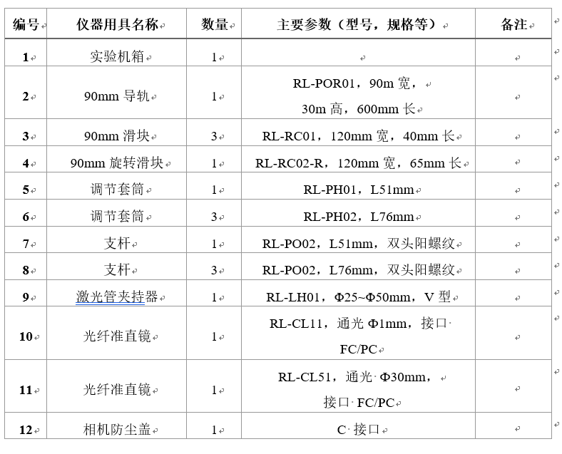

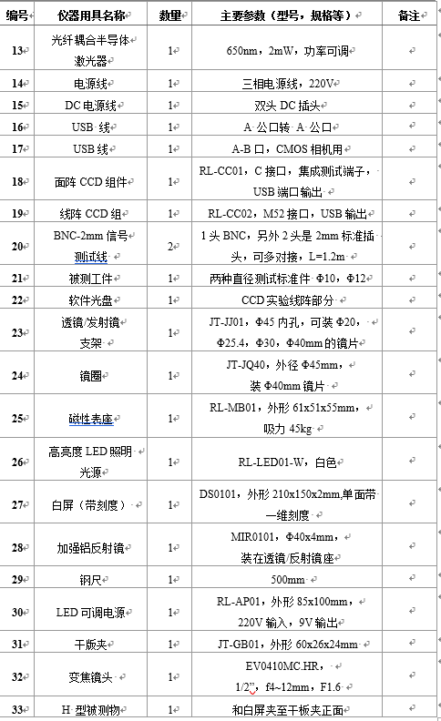

---


## <center>【实验原理】</center>

CCD := (Changed Coupled Device)可以将光学信号转换为电信号。主要有线阵列和面阵列两种基本类型.其主要组成部分：

* 感光部分
* 转移存储
* 移位输出控制部分

移位寄存器为MOS，其电容可以存储电荷。电荷会按一定次数串行输出。

### 成像的主要步骤

1. 对MOS金属栅电极施加时钟脉冲，使下半导体形成势阱
2. 光照射到CCD。存储信号电荷
3. 周期性改变时钟脉冲的相位和幅度，从而制造出时变势阱，使信号电荷定向转移
4. 信号电荷放大滤波后进行ADC
5. 将得到的图像进行处理获得成像

相邻两个SH脉冲之间的时间是像敏单元的感光时间，被称为积分时间。光电荷的输出时间应该小于积分时间才能保证光电信号的完整。

### CCD芯片

**东芝TCD1208AP二相线阵CCD芯片**

TCD1208AP是一款5V供电的高灵敏度、低暗电流的二相线阵图像传感器。其外形如右图所示，它包括2160个有效像敏单元，每个像敏单元大小为14μm（即像敏单元中心间距）。它的基本结构原理图如图D8-3所示，由2212个PN结光电二极管构成光敏元阵列，其中前40个和后12个是用作暗电流检测而被遮蔽的，中间2160个光电二极管是曝光像敏单元，故一行完整的信号输出有2160个像元。每个光敏单元尺寸为14μm×14μm，中心间距也是14μm。光敏元阵列总长30.24mm，光敏单元两边是转移栅，最外边是模拟转移寄存器，其输出部分由信号输出单元和补偿单元构成。

**索尼ICX409AK CCD芯片**

原理结构图如图D8-5所示，它由光电二极管阵列、垂直CCD移位寄存器及水平CCD模拟移位寄存器三部分构成。图D8-6、图D8-7为ICX409AK的垂直同步脉冲和水平同步脉冲时序图，从图中可以看出，在场消隐期间，V1V4及H1、H2上所加的脉冲均属于均衡脉冲，V1、V2为正脉冲，使光积分电极完成光积分。在场消隐期间，V1和V3的正脉冲完成信号由光积分区向垂直移位寄存器转移。转移完成后经过两个行周期的转移进入有效像元信号的输出。在行消隐期间，V1中的信号在V1下降沿倒入V2，V2的下降沿倒入V3，V3的下降沿倒入V4，V4的下降沿倒入H1。在行正程期间，V1V4保持不变，倒入到水平移位寄存器中的信号在水平脉冲的作用下，一个个从CCDOUT端输出。

### 投影成像测量

测量与CCD传感面尺寸相当的物体的尺寸：由理想平行光照射下的阴影宽度得到物体的尺寸。具体地我们通过数据采集系统计算出阴影部分像元的个数与像元尺寸的乘积得到。

由于平行光准制度很难达到理想情况，所以要进行修正，对尺寸进行标定来使测量结果准确。

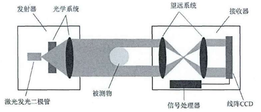

### 角位置测量

没有转动机构的情况下，需要进行角位置测量时，可以采用CCD传感器进行位置测量。将CCD的像素尺寸转换到反射镜的旋转角位置上。

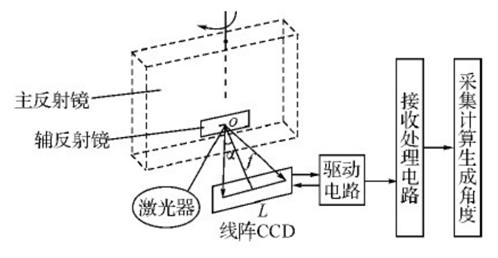

如上图，反射光束照射到线阵CCD探测器上，CCD首先进行光电转换，在驱动脉冲的控制下，将电荷移位到输出电路，经输出电路将电荷量转化为为电压量输出。输出端有与光电荷量成正比的弱电压信号。进行滤波放大后，再进行ADC，可以得到一个映射到角度的数字量信号。

### ADC原理

ADC将模拟信号离散化取样（对坐标轴进行离散数字化）并且量化（对幅值离散数字化）。其中取样率越高信号保真越好，分辨率越高。量化是将由取样所获得的数据以0与1的组合予以编码，同样的量化位数越高则分辨率越高。 
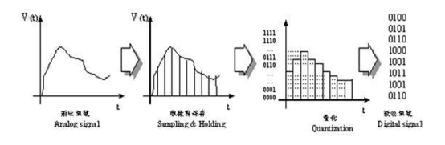

### 灰度图像处理

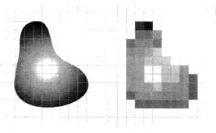

在考虑灰度时，我们的图像数值阵列是这样：
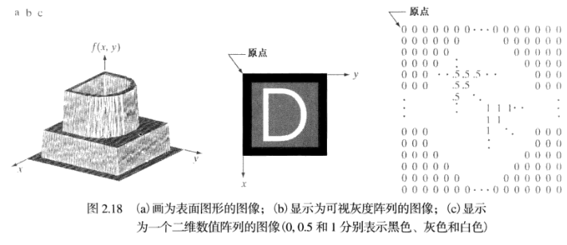

我们可以对图像进行各种仿射变换来达到图像的平移、拉伸、旋转等结果。

#### 二值化转化

在不要求图像灰度的系统中，往往采用二值化图像处理方法。图像:`0`, 背景:`1`。光学系统把被测物体成像在CCD光敏像元上。物体和背景在光强上的变化反映在CCD视频信号中锁对应的图像尺寸边界处有明显的电平变化。

二值化处理（灰度级数为1）的方法之一，固定阈值法:比较简便而且节省空间: 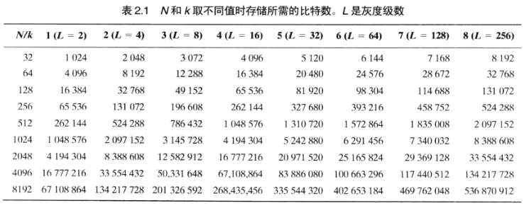

且在对二进制信号处理时我们也可以使用位运算来提高数据处理速率。虽然实际我们在二值变换中是用灰度255（1 byte）来表示大于阈值的像素。
CCD视频信号的幅度稍稍大于阈值电压（电压比较器反相输入端的电位）时，电压比较器输出为高电平；CCD视频信号小于等于阈值电压时，电压比较器输出为低电平。CCD信号经电压比较器后输出的是二值化方波信号。

#### 点算法

灰度线性变换：
$$
GT(g) = Kg + B
$$

* 当$K=1,B\neq 0$，所有像素的灰度值上移或下移。
* 当$K>1$，图像对比度增大
* 当$K<1$，明暗对比度减小，点运算完成图像求补运算。
  其中$K=1, B=0$输出图像等于原图像，$K=-1,B=255$，输出图像灰度反转。

### 彩色图像处理

对于彩色图像，它的显示来源于R、G、B三原色亮度的组合。针对目标的单色亮度、对比度，可以人为的分为“0~255”，共256个亮度等级。"0"级表示不含有此单色，“255”级表示最高的亮度，或此像元中此色的含量为100%。根据 R、G、B 的不同组合，就能表示出256×256×256（约1600万）种颜色。当一幅图像中的每个像素单元被赋予不同的R、G、B 值，就能显示出五彩缤纷的颜色，形成彩色图像。通过彩色图像的处理能提高原图像的质量。

为了使彩色模型更好适应于人解释的颜色，我们使用HSI模型进行描述，色调描述纯色的属性。
$$
H=\left\{ \begin{array}{c}
    \theta ,             B\le G\\
    360\degree-\theta ,   B>G\\
\end{array} \right. 
$$
$$
\theta =\mathrm{arc}\cos \left\{ \frac{\frac{1}{2}\left[ \left( R-G \right) +\left( R-B \right) \right]}{\left[ \left( R-G \right) ^2+\left( R-B \right) \left( G-B \right) ^{\frac{1}{2}} \right]} \right\} 
$$
饱和度分量S:
$$
S=1-\frac{3}{R+G+B}\left[ \min \left( R,G,B \right) \right] 
$$
强度分量I:
$$
I=\frac{1}{3}\left( R+G+B \right) 
$$

## <center>【实验步骤】</center>

### 1 线阵CCD驱动及其特性测量

1. 用12PIN排线连接线性CCD相机和测试面板。USB连接计算机和CCD。
2. 最低功率打开半导体激光器，照射到CCD
3. 打开示波器，**预热后**将CH1接到转移脉冲SH输出端。
4. 调整示波器使波形稳定，达到SH同步，示波器扫描频率调整合适观测SH脉冲的宽度。
5. 同样对于RS信号
6. CH1-$\phi_1$, CH2-$\phi_2$。调节电压刻度和扫描频率，以能同时看到两路测试信号，
7. 记录相位
8. CH1-CCD输出测试空，记录在**光照**和**遮挡**不同情况下的波形

### 2 线阵CCD测量尺寸和角位置

* 工件直径测量
  1. 防止标准块和滚针
  2. 打开线阵CCD相机，进行标定
  3. 将标准块换成被测物
  4. 重复测量

* 角位置测量
  1. 搭建系统，线阵CCD安装在磁座上，相互成一定角度
  2. 打开CCD相机，打开激光器 
  3. 调节反射镜
  4. 得到光斑移动像素宽度，计算得到转动角度
  5. 重复测量

### 4 面阵CCD图像采集、运算和颜色处理

#### 数据采集

1. 搭建装置，连接面阵CCD与计算机
2. 安装白光，调节角度使相机**不曝光**
3. 初始化。开始采集图像
4. 待图像稳定清晰后按下停止驳货按钮，采集一帧图像
5. 分析明暗和灰度之间的关系
   
#### 图像运算
6. 开始采集图像，调整焦距，获得高对比图片
7. 得到情绪图像，获得直方图分布
8. 同样的方法查看对图像进行灰度线性变换。

### 5 测量工件的二维尺寸

1. 防止工件，连接CCD
2. 进行标定
3. 点选特征圆心
4. #### 颜色处理

## <center>【预习思考题】</center>

1．MOS电容器工作原理是什么？ 

> MOS的gate在通电压的一定程度时会在源极和漏极之间形成沟道。这是栅极的氧成为绝缘介质，形成电容

2．光电转换的物理原理是什么？ 

> 光电效应

3．CCD驱动脉冲是如何实现信号电荷转移和输运的？ 

>  驱动脉冲调整势大小，从而实现电荷在势阱之间移动，从一个势阱中跃出后进入下一个势阱

4．请解释转移脉冲SH在线阵CCD中的作用？ 

>  SH的深势阱可以让电极势阱与MOS电容的存储势阱连通，从而辅助实现电荷转移

5．解释为什么修改驱动频率和积分时间会导致线阵CCD相机输出信号产生影响？ 

> 这影响电荷的转移效果

6．如果输入到线阵CCD光敏面上的光太强或积分时间太长，使CCD器件工作在饱和状态，此时线阵CCD输出信号有何特点？ 

>  电子会溢出到相邻结构里，可能造成不期望的光斑成像。也可能造成击穿。

7．相机与反射镜距离的变化会有什么样的影响？ 
8．如果被测物体尺寸宽度太大，超过了线阵CCD相机测量范围，有什么方法可以改善实验中的光路呢？
9．如果图像为全黑或全白，则对应的灰度值应该是多少？ 

> 0，255

10．为什么直方图均衡化能有效增强图像? 

> 可以让灰度光强相近的范围增大，使强弱色的对比更加清晰。且会将某些出现概率更快的灰度减弱，去除“蒙版”感

11．白色的图片在各个不同的通道灰度值有什么特点？ 

> * 单通道 255
> * 3通道图 RGB(255,255,255), 

12．如果被测物体较厚，还能用上述光路测量么？

<center> ## 【实验记录】</center>

<center>### 实验1</center>

| 测试段子     | SH    | RS    | $\phi_1$ | $\phi_1$ |
| ------------ | ----- | ----- | -------- | -------- |
| 周期($\mu$s) | _____ | _____ | _____    | _____    |
| 频率(kHz)    | _____ | _____ | _____    | _____    |

### 实验2

**直径测量**


| 测量次数 | 1     | 2     | 3     | 4     | 5     | 6     |
| -------- | ----- | ----- | ----- | ----- | ----- | ----- |
| 测量值   | _____ | _____ | _____ | _____ | _____ | _____ |
| 误差     | _____ | _____ | _____ | _____ | _____ | _____ |

**转动角度测量**
| 测量次数 |       | 位置1 | 位置2 | 计算角度 |
| -------- | ----- | ----- | ----- | -------- |
| 1        | _____ | _____ | _____ | _____    |
| 2        | _____ | _____ | _____ | _____    |
| 3        | _____ | _____ | _____ | _____    |

### 工件尺寸

| 测量次数 | 1     | 2     | 3     | 4     | 5     | 6     |
| -------- | ----- | ----- | ----- | ----- | ----- | ----- |
| 测量值   | _____ | _____ | _____ | _____ | _____ | _____ |
| 误差     | _____ | _____ | _____ | _____ | _____ | _____ |
# CCD Report

## 1. 线阵CCD驱动及其特性测量


## 2. 利用线阵CCD测量工件直径和角位置

### 直径测量

游标卡尺测得标准块直径为1.260cm，像素宽度902.102500，标定倍数0.001396737\
使用游标卡尺测得工件直径为0.982cm

| 测量次数   | 1     | 2     | 3     |
| ------ | ----- | ----- | ----- |
| CCD测量值 | 0.979 | 0.976 | 0.981 |
| 误差     | 0.003 | 0.006 | 0.001 |

### 转动角度测量

相机到反射镜的距离约为11.25cm
| 测量次数 | 位置1   | 位置2   | 计算角度 | 转动角度读数 |
| -------- | ------- | ------- | -------- | ------------ |
| 1        | 1866.83 | 1401.39 | 1.66     | 2            |
| 2        | 1401.39 | 729.47  | 2.395    | 2            |
| 3        | 729.47  | 274.19  | 1.63     | 2            |
误差来源：

1. 估计相机到反射镜的距离时，使用底座的中线在导轨上的标度来表示反射镜与相机的距离，实际上可能有偏差
2. 激光不一定射在反射镜转轴上，且接收阵列是平面，转动时激光从反射镜到相机的路程有偏差
3. CCD谱不稳定，实验中取出现最频繁的谱峰，会产生误差
   实验讲义中给出的计算反射镜的弧度的公式：
   $\frac{像素宽度\times 14\mu m}{反射镜到CCD相机的距离}$实际上是反射激光扫过的弧度，反射镜转过的弧度是这个弧度的一半

## 4. 面阵CCD图像采集、运算和颜色处理

### a 数据采集

*工件原图*\
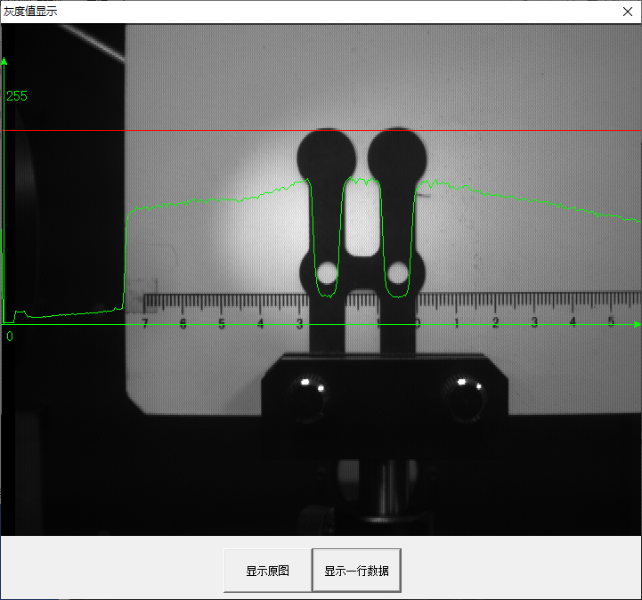

可见越暗的地方灰度值越低

### b 图像运算

   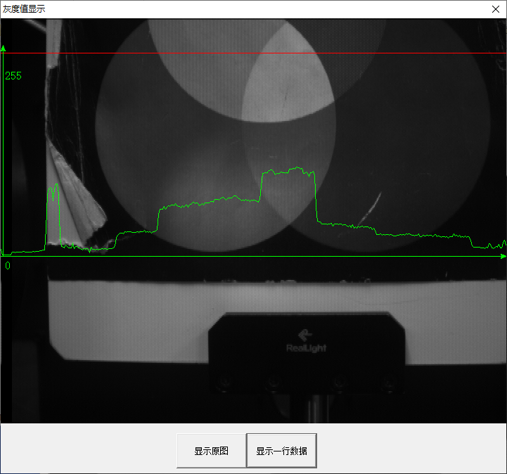
   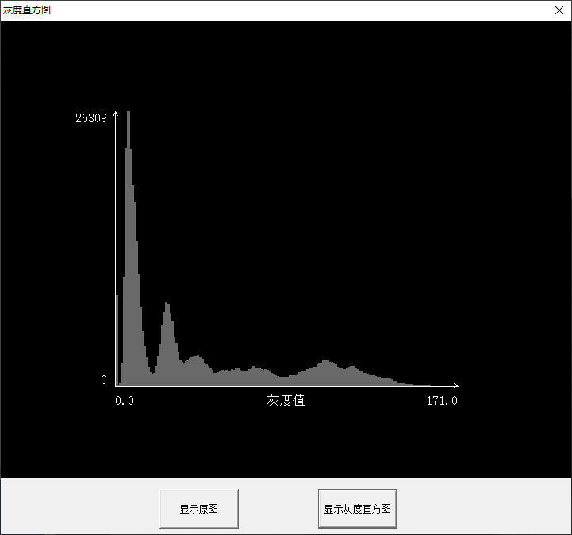
    图片整体越暗，灰度直方图的灰度分布就越接近0

1. 灰度线性变换:\
   顾名思义，对图片的灰度值进行线性变换
   
   $$
   f(x) = ax+b
   $$
   
   

2. 阈值变换:\
   对选定阈值[a,b]外的灰度取0，选定阈值内的灰度取255
   
   $$
   f(x)=\left\{\begin{aligned}& 0 \quad x< a ,x> b\\& 255 \quad a\le x \le b\end{aligned}\right.
   $$

3. 

4. 拉伸变换:
    将原图处在$[x_1,x_2]$区间的灰度拉伸到$[y_1,y_2]$之间
   
   $f(x)=\left\{
   \begin{aligned}
   & \frac{y_1}{x_1}x \quad x<x_1\\
   & \frac{y_2-y_1}{x_2-x_1}(x-x_1)+y1 \quad x_1\le x \le x_2\\
   & \frac{255-y_2}{255-y_1}(x-x_2)+y_2 \quad x>x_2
   \end{aligned}
   \right.$

5. 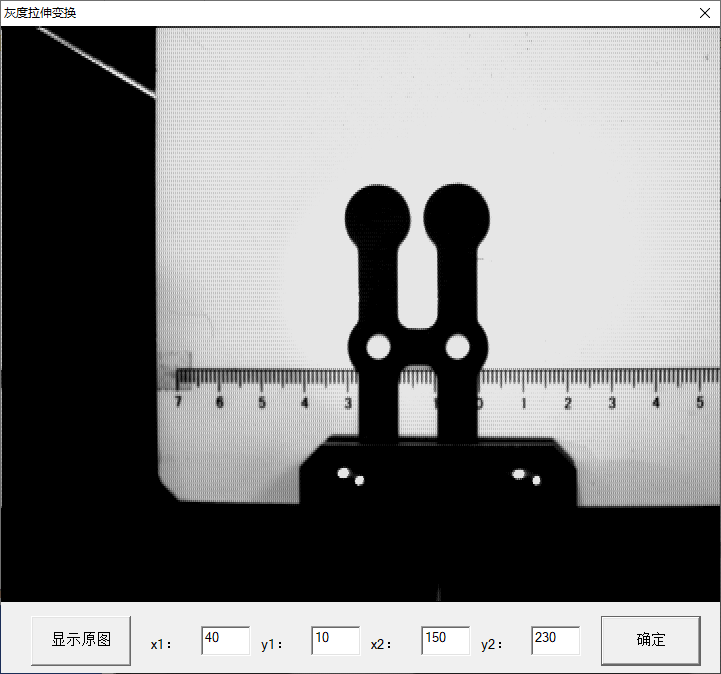

6. 灰度均衡变换
   对密集分布的灰度进行分散，提高图片的对比度 /// <-> 不换行
   
   
   利用python对前三种变换进行模拟，以下是变换函数和图片变换效果
   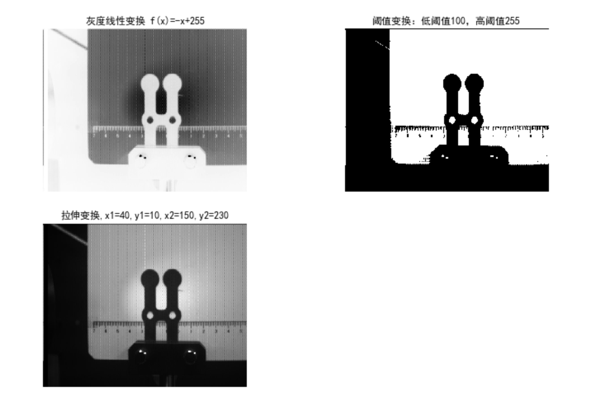

```python
def gray_linertrans(a,b,img):#灰度线性变换
    return a*img + b

def gray_tstrans(img, _max, _min = 0):#阈值变换
    a = img > _min
    b = img < _max
    return (a * b + 0) * 255

def gray_stretchtrans(x1,y1,x2,y2,gray):#拉伸变换
    _gray = gray.flatten()
    for x in _gray:
        if x < x1:
            x = y1 / x1 * x
        if x > x2:
            x = (255 - y2)/(255 - y1) * (x - x2) + y2
        else:
            x = (y2 - y1)/(x2 - x1)*(x - x1) + y1
    return _gray.reshape(np.shape(gray))
```

### c. 颜色处理


从图上看出，蓝色通道的图片整体更暗，灰度值更大

## 5. 利用面阵CCD测量工件二维尺寸


与游标卡尺对照

| 测量量     | 圆半径     | 圆心距      | 平行线距离   |
| ------- | ------- | -------- | ------- |
| CCD测量值  | 2.652mm | 18.415mm | 9.448mm |
| 游标卡尺测量值 | 2.650mm | 18.700mm | 8.968mm |
| 误差      | 0.002mm | 0.285mm  | 0.480mm |

在这里我们取游标卡尺的测量值为参考值。此时不必添加对测量列的不确定度分析

## 【实验中遇到的问题】

在第二部分实验【利用线阵CCD测量工件直径和角位置】中，
实验讲义中给出的计算反射镜的弧度的公式：$\frac{像素宽度*14\mu m}{反射镜到CCD相机的距离}$实际上是反射激光扫过的弧度，反射镜转过的弧度是这个弧度的一半。
