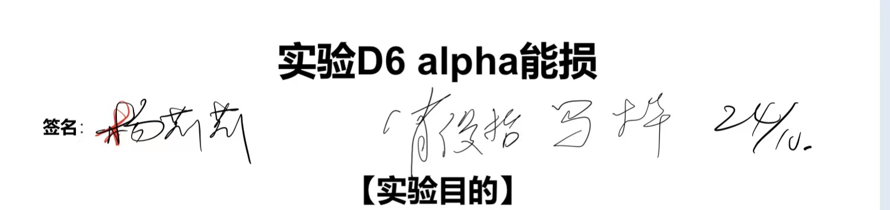
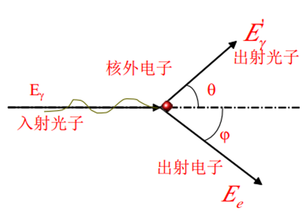
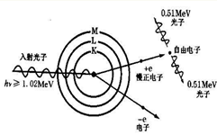
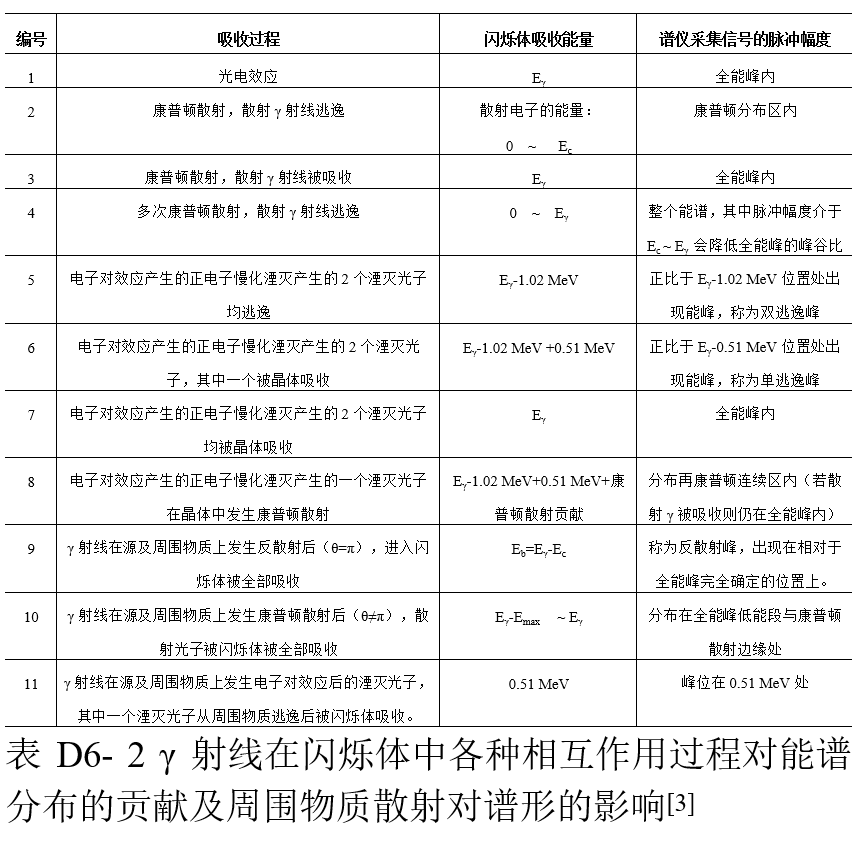
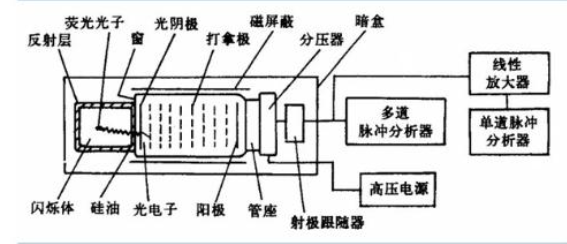

- [ ] 学生签名 
- [ ] 教师签名 （由于和alpha能损是同一个实验室，所以签名到一起）

# 伽马探测报告

## 【概述】

$\gamma$射线是一种高能光子。实验通过对核衰变放射光子测量，了解通过物理相互作用将光子的能量转多个荧光光子，并通过光电倍增管测量荧光光子数，转变为可测量的电信号，从而进一步理解光子能谱与光谱的异同。
$\gamma$涉嫌事波长短于0.2$\mathring{A}$。呈电中性。

**实验目的**
1.      测定γ谱仪的能量分辨率以及能量线性；
2.      测定已知源的γ能谱，并作能谱分析；
3.      随机数据处理；

## 【实验原理】

### 伽马射线与物质的相互作用

#### 光电效应

$m_0$为电子静止质量，$m_0c^2$为静止能量。
当能量$E_\gamma$的入射γ光子与物质中原子的束缚电子相互作用时，光子可以把全部能量转移给某个束缚电子，使电子脱离原子束缚而发射出去，光子本身消失，发射出去的电子称为光电子，这种过程称为光电效应。发射出光电子的动能
$$
E_e = E_\gamma - B_i
$$
其中，$B_i$为束缚电子所在壳层的结合能， 这里内部的电子脱离束缚壳层，此时原子被激发，外部壳层的电子会填补进刚刚脱离的电子形成的空位并放出特征X射线。$\gamma$射线与物质原子发生光电效应的反应截面$b\propto Z^5, b\propto E_{\gamma}^{\frac{7}{2}}$. 从而我们知道：

- 重元素的光电效应反应截面大于轻元素 
- 低能伽马射线比高能发生光电效应的反应截面更大
- 当伽马射线能量低至接近电子结合能，$E_\gamma \sim B_i$，反应截面最大

#### 康普顿效应

γ光子与自由静止的电子发生碰撞，而将一部分能量转移给电子，使电子成为反冲电子，γ光子被散射改变了原来的能量和方向。计算给出反冲电子的动能为
$$
E_e = \frac{E^2_\gamma (1-\cos{\theta})}{m_0c^2 + E_\gamma(1-\cos{\theta})} = \frac{E_\gamma}{1 + \frac{m_0c^2}{E_\gamma (1 - \cos{\theta})}}
$$

可见当$\theta=180^\degree$时，反冲电子动能取最大$E_m$, 为康普顿边界$E_C=E_m=\frac{E_\gamma}{1+\frac{m_0c^2}{2E_\gamma}}$
此时， $E_\gamma' = \frac{\frac{m_0c^2}{2E_\gamma}}{1 + \frac{m_0c^2}{2E_\gamma}}E_\gamma$, 进行下一级的碰撞。

#### 电子对效应

现在不改变散射角度，考虑$\gamma$光子的能量$E_\gamma$.当$E_\gamma > 2m_0c^2$, $\gamma$光子从对其有核库仑场作用的核旁经过时，可能转为为一堆正负电子。此时
$$
E_\gamma = E_e^+ + E_e^- + 2m_0c^2
$$
湮灭产生两个光子，湮灭时，正负电子动能为0，总能量等于电子对静止能量。者两个光子会被物质吸收若干个或者发生康普顿散射

### 闪烁伽马能谱仪

综合之前的现象，我们通过测量光电子产生的**次级带电粒子**（可能是：光电子、反冲电子、正负电子对）的能量来得到$\gamma$光子的能量。
闪烁谱仪的各部分：

#### 探头与高压

- 闪烁体
  
  > 在**次级带电粒子**的作用下产生**数目与入射γ光子能量相关**的荧光光子。它们光电倍增管，在其光敏阴极再次发生光电效应产生光电子，再数次放大，最后在倍增管阳极形成脉冲信号，虽然说闪烁体会再产生光电子，但是最终只是放大不同入射带电粒子能量所能激发的光电子的数目，便于分析的。

- 光电倍增管

- 分压电路

- 屏蔽外壳

#### NaI(TI)闪烁体探测器测量$\gamma$能谱形状

图的纵轴代表各道址中的脉冲数目，横轴为道址，对应于脉冲幅度或γ射线的能量。

**全能峰**： 代表$\gamma$射线的能量，$E_e + B_i = E_\gamma = E_e + E_z$. $E_z$为光电子逸出留下的空位让外层电子跃入而放出的X射线能量。这个能量和束缚能显然是相同的。 对于$^{137}$Cs, $E_\gamma=0.662$MeV。

#### 谱仪能量刻度和分辨率

<!--  
使用同级heading. 是便于查看
-->

#### 能量刻度

闪烁谱仪测得的$\gamma$射线能谱的形状及能量值由核素的衰变纲图所决定。是各核素的特征反应。但脉冲幅度和工作条件相关$\implies$应用γ谱仪测定未知射线能谱时，必须先用已知能量的核素能谱来标定γ谱仪。

能量$E$和道址$N$：
$$
E_\gamma = kN+b
$$
从而只需要求得$k,b$即可。

#### 分辨率

$$
\eta = \frac{FWHM}{E_\gamma}\times 100\%
$$

其中FWHW = Full Width Half Maximum。闪烁谱仪测量中，会伴随统计涨落。我们可以进行统计分析。

## 【预习思考题】

1.      简述γ光子与物质的相互作用类型，及其产生的次级粒子与原入射光子的能量关系。

> 根据相互作用的方式和$\gamma$光子的能量不同，有光电效应、康普顿效应、电子对效应。

| 类型  | 光电效应                    | 康普顿效应       | 电子对效应                        |
| --- | ----------------------- | ----------- | ---------------------------- |
| 能量  | 全部转移且$E_e \le E_\gamma$ | 部分转移，光子弹性散射 | $E_\gamma > 2m_0c^2$，光子非弹性散射 |

2.      探测器中的光电倍增管，射线的光电效应会对其测量产生影响吗？影响能有多大?

>   影响比较小，倍增管主要是增加对应道址，即对于一个入射的带电粒子所能激发的光电子的数量，通过这些数量的多少来反应不同能量的分布情况。一些产生荧光光子的带电粒子产生了光电子，可能会减小在能量较高的区域的脉冲幅度
> 3.      有一单能γ源，能量为2MeV，根据γ与物质的相互作用及NaI（TI）闪烁能谱仪输出信号幅度的关系，预测能谱形状。
> 全能峰吸收2MeV具有，具有全能峰（光电峰）、湮灭峰、和峰
> 4.      闪烁谱仪是常用的γ能谱仪，简述闪烁谱仪的的结构图和各部分功能。
> 闪烁体、光电倍增管、分压电路、屏蔽外壳
> 
> 闪烁体是同于产生荧光光子的。其数目与$\gamma$射线能量相关，光电倍增管能在低能级光度学和光谱学方面测量波长200~1200纳米的极微弱辐射功率。分压电路可以调整光电倍增管打拿极的电压  。外壳可以减弱，如热电子、欧姆漏电、切伦科夫光子等噪声

## 【仪器用具】

## 【分析讨论】

### 标定谱仪能量刻度和分辨率

我们根据和

得到

标定得:
$$
E = 0.0004N + 0.4885 (MeV)
$$
于是我们可以求得$E=0.51$MeV对应537.5道址，$E=1.02$MeV对应道址1328.75. 
现在来得到分辨率
$$
\eta = \frac{FWHM}{E_\gamma}\times 100\%
$$
$$
\eta_{Cs} = \frac{23.13}{0.66}=35\% 
$$
$$
\eta_{Co} = \frac{65.9}{1.17} =  56.3\%
$$

### 能谱的分析

我们由软件可以得到一系列的分析结果。下面能量全部用$E\propto N, E^p$表示。$E^p$是标定刻度的预测值
第一幅图是Co的，出现了$E_C=E_3\propto 1281, 1.001$MeV, 左侧的全能峰$E_4\propto 1636.95, 1.14328$MeV, 对应道址预测$E_b'=E_4-E_C=355.95, 0.6309$MeV, 实际$E_b=E_2\propto 332, 0.6213$MeV. 相差了$f=\frac{E_b' - E_b}{E_b} = 7\%$.

可以发现上图采样效果并不好。

现在来看$^{137}$Cs的谱图

$E_\gamma \propto 468, 0.66$MeV, $E_C\propto 305, 0.6105$MeV, $E_b' = E_\gamma - E_C = 163, 0.5537$MeV.实际测得$E_b=170$MeV.相差$4\%$.