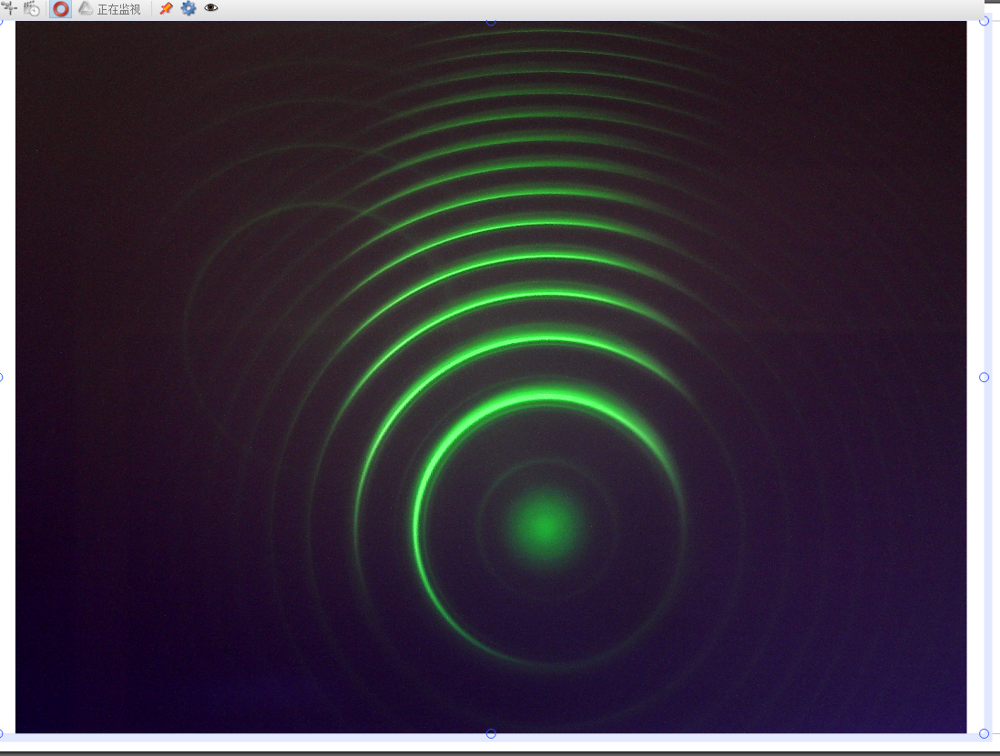
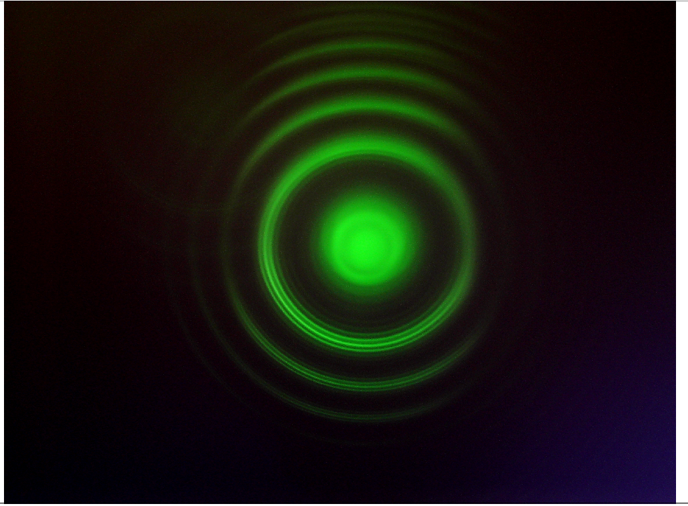
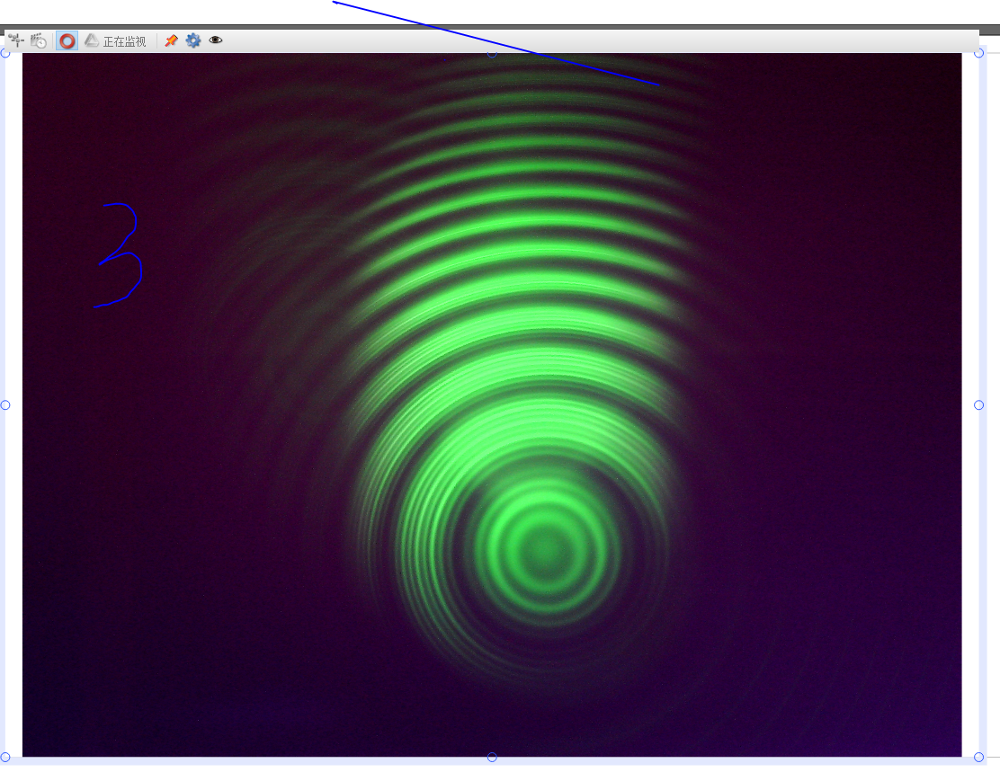
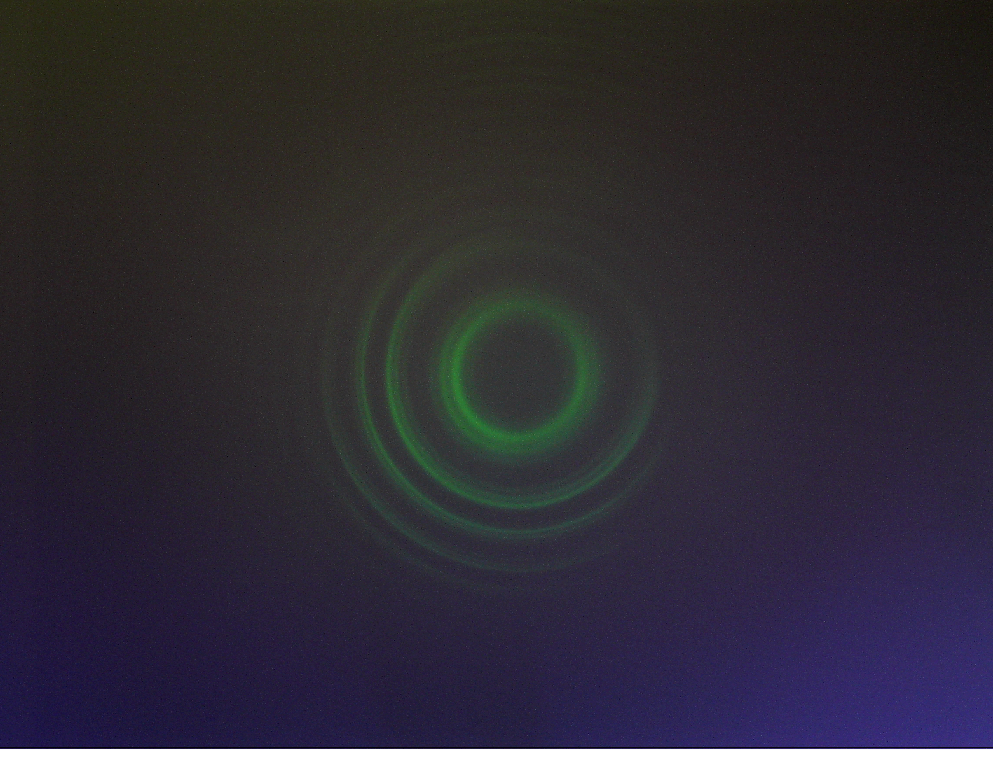
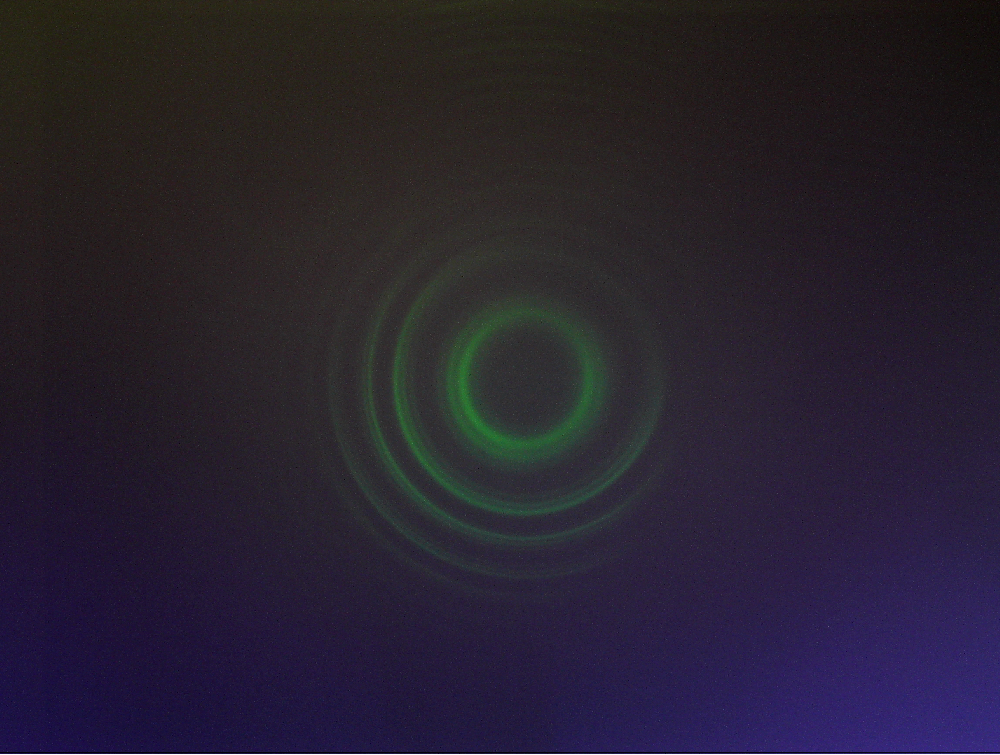
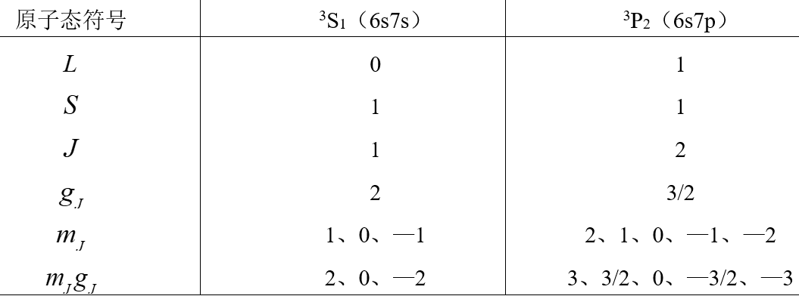
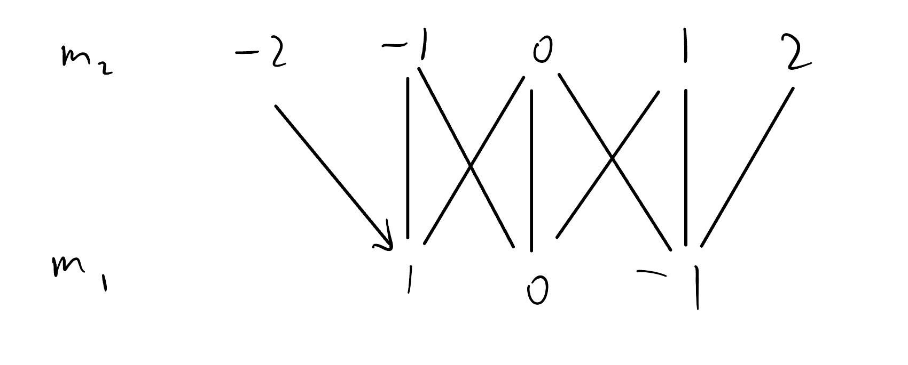

 ## 
【实验结果处理】

 不加磁场的干涉图样：
 
 线圈电流为4.99A时的干涉图样，此时偏振片90°刻度线对准白线。
 
计算荷质比

旋转偏振片至45°

此时可以看到一个能级分裂出的9条谱线

旋转线圈使得磁场方向平行光路，此时不论偏振片旋转何种角度，看到的图像均一样

*偏振角度0°*

*偏振角度45°*

*偏振角度90°*

## 
【实验思考题】

1. **光子是否具有角动量？试描述光子角动量方向与光的偏振方向之间的关系。**

    光子具有角动量$\hbar$，圆偏振光的角动量方向平行于传播方向，线偏振光的角动量垂直于传播方向与E方向
2.	**用同一级条纹的内外圈分别计算电子的荷质比，结果一样吗？试简述原因。**

3.	**请利用（20）至（23）式，计算汞原子$^3S_1(6s7s)$和$^3P_2（6s7p）$能级所对应的量子数（见表1），并给出详细的计算过程。**

$$
L_1 = 0+0=0,\quad L_2=1+0 =1\\
S_1 = 0,1, \quad S_2 = 0,1\\
J_1 = 0,1,\quad J_2 = 0,1,2\\\
^3S_1对应L=0,S=1,J=1,^3P_2对应L=1,S=1,J=2
$$

4.	**请利用（2）、（8）和（20）式，并结合$\vec{J}=\vec{L}+\vec{S}$和$\vec{\mu_J}=\vec{\mu_L}+\vec{\mu_S}$（注意此时的$\vec{\mu_J}$是图5中的$\vec{\mu_J}$，详细见脚注22），导出朗德因子的一般表达式（28）式，并给出详细的推导过程。**

$$
\mu_j=\mu_lcos<l,j>+\mu_scos<s,j>=(-g_l\sqrt{l(l+1)}\mu_B)\frac{j(j+1)+l(l+1)-s(s+1)}{2\sqrt{j(j+1)l(l+1)}}+(-g_s\sqrt{s(s+1)}\mu_B)\frac{j(j+1)+s(s+1)-l(l+1)}{2\sqrt{j(j+1)s(s+1)}}\\
又\mu_j=-\sqrt{j(j+1)}g_j\mu_B,g_l=1,g_s=2\\
可得g_j=\frac{3}{2}-\frac{1}{2}\frac{l(l+1)-s(s+1)}{j(j+1)}
$$

5.	**请利用单电子情况下的（36）式，并结合钠双黄线的平均波长及其波长差（λ1 = 589.0 nm，λ2 = 589.6 nm），估算一下钠原子内部的磁感应强度$B_{int}$的值（提示：单电子情况下，两谱线的能级差为势能的两倍，即有$\Delta E=\Delta U=2\mu_BB$；另需要利用到光子波长和频率之间的关系式。答案：钠原子内部的磁感应强度$B_{int}$的值为18.5T）。**

    $B=\frac{\Delta E}{2\mu_B}=\frac{hc(\frac{1}{\lambda_1}-\frac{1}{\lambda_2})}{2\mu_B}=18.5T$

6.	**请结合第5题的计算结果，说明弱外磁场$B_{ext}$<<$B_{int}$成立时弱外磁场$B_{ext}$的取值范围，并确认本实验中电磁体的磁感应强度符合弱外磁场$B_{ext}<<B_{int}$条件。**

7.	**请结合力与势能的关系式 并利用（11）式，试推导磁矩在非均匀外磁场中的受力大小为$\vec{F}=-\nabla U$（设外磁场方向在z轴方向，Fz为力在z方向上分量的大小$F_z=\mu_z\frac{\partial B_z}{\partial z}(B_x=B_y=0)$）（提示：请利用郭硕鸿《电动力学》（第二版）一书附录中的矢量运算公式）。**

    $F_i=\mu_i\frac{\partial B_i}{\partial x_i}$
    则$F=\mu \cdot \nabla B=-\nabla U$

8.	**请结合朗德因子的一般表达式（28）式，以及两个角动量耦合的一般规则（20）至（23）式，计算表3中汞原子546.1nm谱线对应的上下两个能级的各量子数及不同谱线（能级跃迁）的朗德因子（见图9）。用“格罗春图” （Grotrain图）来表示汞原子546.1nm谱线不同能级之间可能的跃迁。**

9.	**请回答什么是“反常塞曼效应”和“正常塞曼效应”，两者之间的区别是什么。请思考什么是“帕邢－巴克效应”及其形成的原因。**

    当电子的总自旋为0时，一条谱线在外磁场下一分为三，这被称为正常塞曼效应，电子的总自旋不为0时，一条谱线分裂的数目不为三个，间隔也不尽相同，这被称为反常塞曼效应。
    帕邢－巴克效应：外加磁场强度足够大时，自旋、轨道角动量分别绕外场旋进，不再合成J，反常塞曼效应趋向于正常塞曼效应。

10.	**请回答电子的“自旋—轨道耦合”的本质是什么？它与电子之间的“LS耦合”的区别是什么？**

电子的自旋-轨道耦合笼统得指电子的轨道运动造成的磁场作用于电子自旋的磁矩。实际要分LS耦合和jj耦合
LS耦合指电子自旋之间的作用和电子轨道运动之间作用很强，轨道角动量和自旋角动量先各自耦合再合成总角动量

11.	**请结合多电子原子及电子组态的相关知识，思考为什么像汞原子一样有两个价电子的元素（氦He和镁Mg等第二族（碱土族）元素），会有两套不同的谱线（一套是单线结构，一套是双线结构）。**

    激发态电子的自旋方向不同。

12.	**设F-P标准具两反射面之间的距离为d=2 mm，请根据（47）式估计汞原子546.1nm谱线的自由光谱范围。**

13.	**请根据（38）式，估计在外磁场为B=1T时观察汞原子546.1nm谱线分离所要求的仪器分辨率的$\frac{\lambda}{\Delta \lambda}$，并讨论用F-P标准具观测的必要性（一般棱镜摄谱仪的理论分辨率为103~104，F-P标准具的理论分辨率为105~107，实际分辨率比理论值要略低一些）。**

14.	**仔细观察垂直磁场方向观察，旋转偏振片至45°角的纪录，会发现同一级条纹在磁场中分离成不只三条，请解释出现这一现象的原因。**

15.	**本实验要求精度为实验测量误差小于等于5%，请分析本实验误差的主要来源，并提出相应的修正方法。**

    误差的主要来源为用三点定圆法计算圆环半径时偏差，这个偏差在荷质比计算公式被四次方放大。可以尝试增大线圈电流使谱线分离更明显，暗室操作减小散光进入等操作来减小误差。

16.	**请尝试计算钠双黄线（又称“钠D线”，是由钠原子从$^2P_{\frac{1}{2},\frac{3}{2}}$到$^2S_{\frac{1}{2}}$态的跃迁所产生）谱线的塞曼分裂（如图21），可能的话，设计具体实验步骤并进行观察验证。**
