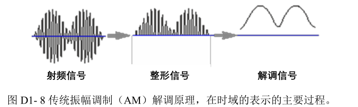

## 微小阻抗测量

### 实验目的

* 学习使用锁相放大器
* 精确测量某一个元件或线路的微小阻抗

### LIA基本原理重述

锁相放大器(Lock-in Amplifier), 对于弱毫伏量级的信号有较好的测量效果。我们主要的测量过程在锁相和噪声滤除上。下面阐述基本原理
**热噪声**:

> 对于一项实验，无规的热噪声既可来自于实验对象本身，也可来自于测量系统，包括传感器和测量仪器。**信噪比**:
> 信噪比是科学与工程中常用的一种度量，用于表征相对于背景噪声的信号强度，或信号的覆盖程度。为方便在宽范围内表述，以信号强度与噪声强度之比($I_S/I_N$)定义的信噪比(SNR: signal noise ratio)取常用对数，以分贝为单位

$$
SNR = 10 \log{\frac{I_S}{I_N}}
$$

我们再定义信号改善比

$$
SNIR = \frac{SNR_o}{SNR_i}
$$

#### 噪声测量处理技术

现在我们来滤除噪声，

* 简单滤波法
  滤波法只适用于测量信号和噪声$f_s \ne f_n$的小信号情况。
  **一个有噪的直流信号**可以用低通滤波器除噪。用工频陷波器来给(50Hz_).
  带通滤波适用于高频率小信号。
  一般地示波器会采用这种方法。
  
  设输入信号$x(t) = s(t) + n(t)$, 用$_s$表示待检信号。

$$
x(t) = a\cos{\omega_s t} +  foo_{a}^{b}(other_waves)
$$

我们对总体进行带通滤波(BPF)，信号为:

$$
x(t) = a\cos{\omega_s t} (remain still) +  foo_{a-\Delta \omega / 2}^{b+\Delta \omega / 2}(other_waves)
$$

其中$\Delta \omega$为带同宽度。其余方法如LPF同理, 锁相放大器也采用LPF.
对于LPF的实现，我们根据RLC串联电路的特性。

$$
H(\omega) = \frac{1}{1 + j\omega RC}
$$

* 调制解调技术
  有AM/FM之分。
* 相敏检测
* 锁相放大法
  
  LIA也是采用LPF，所以直流或者慢变信号对他来说需要额外处理。LIA与一般地LPF的最大不同在于其使用了高质量的相敏检波技术

1. 它先将直流或者慢变信号的频谱迁移到$\omega_m$处，再进行放大。
2. 利用相敏检测器PSD对被调制信号**解调**，可以同时利用频率휔푚和相角θ检测信号,因为噪声与信号既同频又同相的概率很低
3. 用低通滤波器来抑制宽带外的噪声。低通滤波器的频带可以做得很窄,而且其频带宽度不受调制频率的影响
   锁相环内部的参考信号（实际与放大输入信号一起通过PSD的信号）是和输入的外部参考信号$v_R$同频率且相位差锁定的参考信号$u_{ref}$。产生原理:
   

当然这个参考信号不一定都得是内部在生成的，它也可以是直接的外部参考信号，我们引入内部的整形主要是为了保证参考信号的稳定。

#### LIA的具体工作原理

输入信号$u_i(t) 放大\rightarrow A_Iu_i  \rightarrow PSD(A_I u_i  u_{ref}) \rightarrow LPF \rightarrowtail u_o$

### 微小阻抗测量原理

微小阻抗：微小感抗、微小容抗、微小电阻，阻值在微欧量级。在很多场合，更
需要测量的是电阻、或电感、或电容的微小变化。
* 电流通过微小热敏阻抗或者热敏阻抗自身变化引起的压降比较小，SNR$\Downarrow$。我们使用LIA测量之。
* 容感元件在不同频率下的阻抗也不同，分布的、极小的电容影响精密测量
先明确结果影响因素：
* 引线
* 接触电阻
* 内阻
* 接触点温差电势

### 分压法测量

##### 微小电感
$$
\tilde{Z}_L=j\omega L, \\
Z_R = R
$$
所以同时考虑低频下的电阻和电感的微小测量.对于一个标准的R,C串联电路:
  
$$
\tilde{V}_{out}=\frac{Z_X}{Z_S+Z_X}\tilde{V}_{in}=\frac{r_x+j\omega L_x}{r_s+r_x+j\omega L_x}\tilde{V}_{in}
\\
\frac{V_{in}e^{i\omega t}}{r_s+r_x+j\omega L_x}=\frac{V_{out}e^{i\left( \omega t+\varphi \right)}}{r_x+j\omega L_x}
\\
V_{in}\frac{{r^2}_x+\omega ^2{L_x}^2}{{r_s}^2+{r_x}^2+\omega ^2{L_x}^2}\left( r_s+r_x+j\omega L_x \right) =V_{out}\left( r_x\cos \varphi +\omega L_xsin\varphi +j\left( r_x\sin \varphi -\omega L_x\cos \varphi \right) \right) 
\\
\mathrm{Re}\left\{ Left \right\} \,\,=\,\,\mathrm{Re}\left\{ Right \right\} , \mathrm{Im}\left\{ Left \right\} =\mathrm{Im}\left\{ Right \right\} 
\\
\Longrightarrow 
\\
r_x=\frac{V_{out}\left( r_s\cos \varphi -\omega L_x\sin \varphi \right)}{V_{in}-V_{out}\cos \varphi}
$$
若$Z_X$为纯电阻，则$L_X = 0, \varphi = 0, r_x = \frac{V_{out}}{V_{in} - V_{out}}r_s$

##### 测微小电容
$$
C_X = \frac{V_{out}}{V_{in} - V_{out}}C_0
$$
可以得到待测电容。
分压法的输出电压进入锁相放大器， 能够得到时变的小阻抗信号。由于LIA的在低频段效果不甚理想，于是我们必须考虑低频下的本底的消除。

<!-- TODO: 开些仪器表。设备明确, 不用的不写， 具体参数 -->
### 实验材料

**实验对象**
* 可调节板间隔（变化）的平行板电容和变容二极管电容随偏置电压的变化。

**仪器用具**

桌号:  B3
LIA:  D6251863，双通道

面包板接触电阻太大

**报告包含所搭建的测量单元的实物照片**

<!-- TODO: 设计 -->
### 实验设计

### 实验步骤

#### 实验准备
<!-- FIXME: 重改-->
1. 测量小电阻/小电感
   1. 区分精密电阻和厚膜电阻，并通过实验判断用于测量电流相位的电阻（$R_S$，如精
      密电阻或厚膜电阻）是纯电阻
   2. 按实验方案的示意图接好线路；
   3. 手动测量；
2. 测量小电容及其变化
   1. 在教学实验箱上连接待测电容，如变容二极管、或自制电容（如可调间距的平板电容、双绞线电容等）；
   2. 按实验方案连线示意图对教学实验箱与锁相放大器接线：包括锁相放大器信号输出、输入，反偏直流电压点 DC-Vt 电位测量（查 OE1022 说明书，注意单通道与双通道锁相放大器的不同。）
   3. 设置参考信号频率与振幅；
   4. 小心缓慢调节教学实验箱上的电位器，使得变容二极管的反偏直流电压DC-Vt 从1 至 7.9V 逐渐变化，变化步长为 0.2V，逐点记录 DC-Vt 和锁相放大器 R 值；
   5. 记录测量值，结束后利用(D1- 55)式计算二极管电容，并作 DC-Vt 的曲线
      关系图。
3. $C_x=\frac{V{out}}{V_{in}-V_{out}}C_0$
   如图所示，用教学实验箱给二极管加偏置电压，用OE1022提供信号源（式中的$V_{in}$为SINE OUT信号发生器输出信号，经实验箱变压器提压以及直流隔离，加载测量电路上；式中的$V_{out}$为输入锁相放大器$signal_{in}$的信号，即$V_{out}$是OE1022测得值幅值R，$C_0=6.8nF$
   
  
为小电容简图
### LIA思考题

<!-- learn: 快速回顾 -->
1. 市频 50Hz 干扰通常通过电源耦合，影响仪器的测量结果；对于 997Hz 的待测信号，50Hz 干扰是噪声吗？对锁相放大器的测量会有影响吗？
2. 如何用锁相放大器检测到待测的直流信号或慢变信号？(图 D1-9 中的$v(t)$为直流或慢变信号)
3. 如用斩波器调制直流信号（如光强）
   ，被斩制后的信号（图 D1-9 中的$u(t)$信号）仍然包含有直流分量（即平均值不为零），但该直流分量随交流信号输入锁相放大器不会被锁相放大器检测，请从数学推导上说明。
4. 相位以及相位差的含义是什么？锁相放大器输出的是待测信号的相位还是待测信号与参考信号之间的相位差？

### 测量微小电阻思考题
待测电容
$$
C_x = \frac{V_{out}}{V_{in} - V_{out}} \tag{A}
$$
1. 对于电流(纯电阻压降)，电容的压降为虚部，在推导(A)式时，为何没有考虑虚部的贡献？
首先，我们先导出:
$$
\tilde{Z}_C=\frac{1}{j\omega C}=-j\frac{1}{\omega C}\Longrightarrow 
\\
V_{out}e^{i\left( \omega t+\varphi \right)}=V_{in}e^{i\omega t}\frac{\frac{1}{\omega C_0}}{\frac{1}{\omega C_0}+\frac{1}{\omega C_X}}=V_{in}e^{i\omega t}\frac{C_X}{C_X+C_0}
\\
\frac{C_X+C_0}{C_X}=\frac{\tilde{V}_{in}}{\tilde{V}_{out}}\Longrightarrow C_X=\frac{C_0}{\frac{\tilde{V}_{in}}{\tilde{V}_{out}}-1}=C_0\frac{\tilde{V}_{out}}{\tilde{V}_{in}-\tilde{V}_{out}}
$$
由于电路简图中，我们并入了一个电容，又串如一个电容，所以对单电容造成的相差有了抑制效果。于是可以有:
$$
\varphi \approx 0 \implies C_0\frac{\tilde{V}_{out}}{\tilde{V}_{in}-\tilde{V}_{out}} = C_0\frac{V_{out}}{V_{in}-V_{out}}
$$
<!-- ToBeImpl: 思考题2 -->
2. OE1022的输入阻抗为10M$\Omega$，等效电容为 25~30pF（见手册），请在简化模型（图 D1-37 的原理图）的基础上画出等效电路（提示如图 D1- 43）；并且，分析忽略它会造成的误差有多大？是属于什么误差？
<!-- ToBeImpl: 思考题3 -->
3. 定量分析反偏直流电压与二极管结电容的关系，并通过拟合(D1- 61)式，判断所测的PN 结是哪种结：
$$
C_j(v) = \frac{C_{j0}}{(1-\frac{v}{v_D})^\gamma}
$$
其中， $C_{j0}$为偏置电压为零（V= 0）时的结电容，γ为电容变化系数，它的值随半导体的
掺杂浓度和 PN 结的结构不同而异，$V_D$为接触电势差。