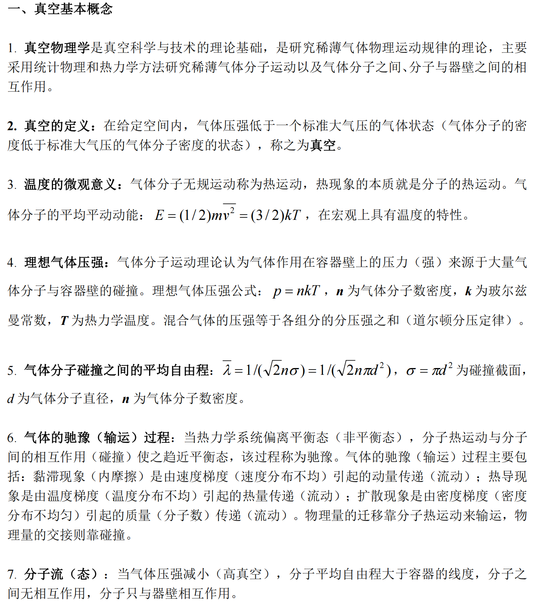
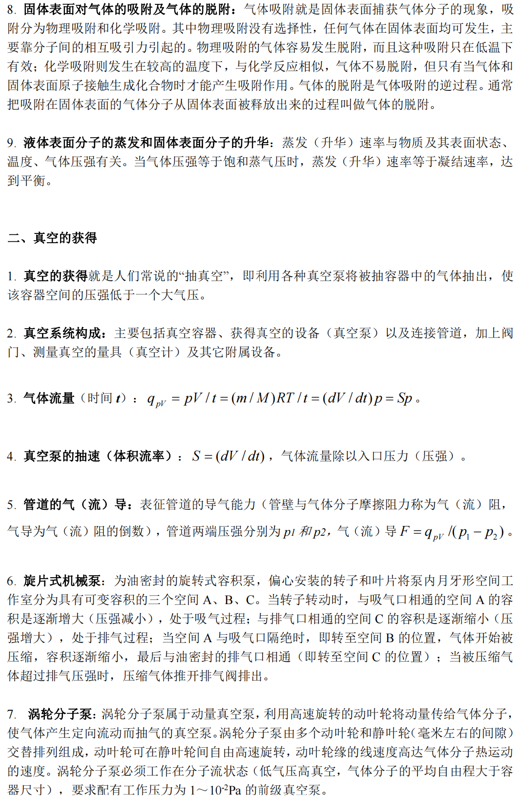
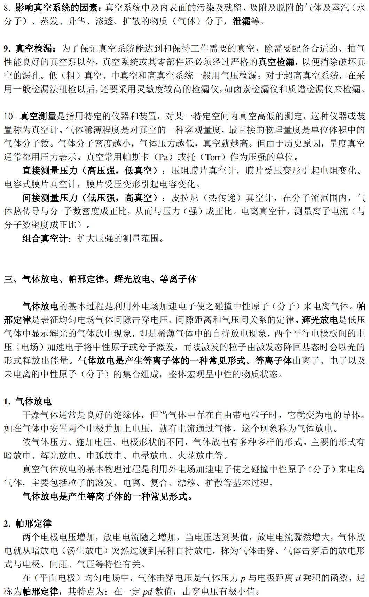
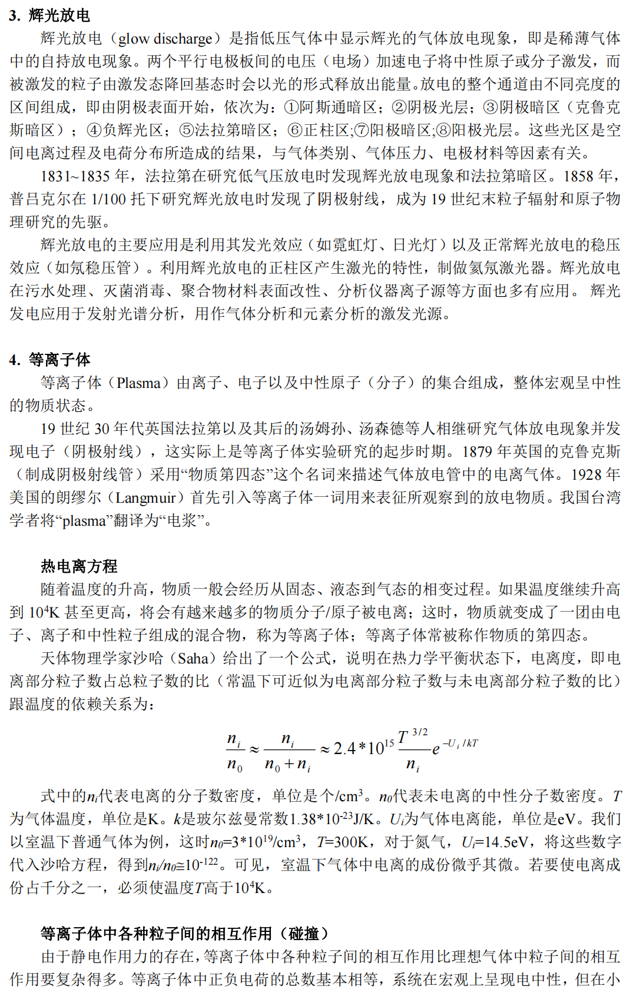
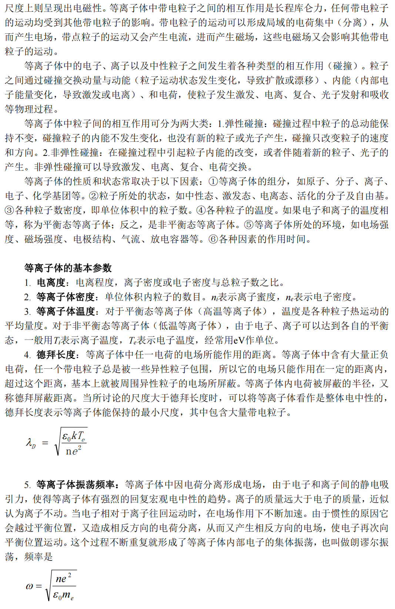
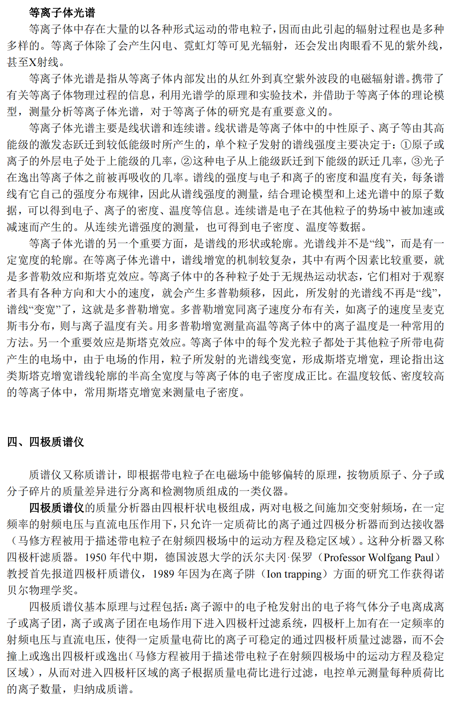

- [ ] 学生签名 
- [ ] 教师签名 
## 【概述】

$\gamma$射线是一种高能光子。实验通过对核衰变放射光子测量，了解通过物理相互作用将光子的能量转多个荧光光子，并通过光电倍增管测量荧光光子数，转变为可测量的电信号，从而进一步理解光子能谱与光谱的异同。
$\gamma$涉嫌事波长短于0.2$\mathring{A}$。呈电中性。

**实验目的**
1.      学习基本的真空知识和技术，掌握真空的获得和测量方法
2.      通过真空气体放电实验，验证帕邢定律，了解气体放电基本物理过程
3.      利用光纤光谱仪研究真空气体放电等离子体光谱特性，获得等离子体基本参数，了解等离子体物理的基本知识
4.      了解四极质谱仪工作原理，使用四极质谱仪进行真空系统检漏和气体成分分析

## 【实验原理】

## 【实验内容】

1． 使用机械泵和分子泵获得高真空。**（参考附件1-宜准VQP01真空平台使用说明及附件2-宜准VQP01真空平台主要参数）**
    1.1 启动机械泵观察记录真空度（真空计压强） 随时间（5 分钟） 的变化。 机械泵先抽真空压强低于 10 Pa 后， 启动分子泵观察记录真空度（ 真空计压强） 随时间的变化，待分子泵达到额定转速（约需 8 分钟）后再观察记录（5 分钟）。
    1.2 停止分子泵观察记录真空度（真空计压强） 随时间的变化（分子泵转速降为零约
    需 8 分钟）。待分子泵完全停止后，关闭机械泵，记录真空度（真空计压强）随时间的变化（5 分钟）。
**思考：真空度（真空计压强） 随时间变化反映了真空系统的什么特性？**

2． 通过真空气体放电实验，测量击穿电压与电极间隙和气压之间的关系，验证帕邢定律，了解气体放电基本物理过程。**（参考附件3-真空帕邢实验方案）**

3． 观察气体放电（发光） 现象， 利用光纤光谱仪研究气体放电产生的等离子体光谱特性， 获得等离子体基本参数， 了解等离子体物理的基本知识。

**思考： 等离子体光谱反映了等离子体的什么特性？ 能得到等离子体的什么参数？**

4． 了解四极质谱仪工作原理， 使用四极质谱仪进行真空系统检漏和气体成分分析。**（参考附件4-四极质谱实验方案、附件5-四极质谱仪使用说明、附件6-四极杆质谱仪原理和技术）**

**探讨： 研究四极电场特性及其中离子运动方程， 深入探讨四极质谱仪工作原理。**

## 【仪器用具】
上海宜准公司VQP01真空平台。（针对帕邢实验、四极质谱实验等实验项目而设计的一台综合实验装置，该装置由真空放电腔体、机械泵、分子泵、高压电源、四极质谱仪、真空计以及击穿电压测量系统等装置构成。）

## 【实验前思考题】
1. 真空物理学的研究内容及方法
   >研究内容：稀薄气体物理运动规律，研究方法：采用统计物理和热力学方法研究稀薄气体分子运动以及气体分子之间、分子与器壁之间的相互作用。
2. 真空的定义？理想气体压强公式？气体分子的平均自由程？
   >给定空间内气体压强低于一个标准大气压的气体状态称为真空。理想气体压强公式：$p=nkT$，n为气体分子数密度，k为玻尔兹曼常数，T为热力学温度。混合气体的压强遵循道尔顿分压定律。分子自由程：$\bar \lambda = \frac{1}{\sqrt{2}n\sigma} =\frac{1}{\sqrt{2}n\pi d^2}$，$\sigma=\pi d^2$为碰撞截面，d为气体分子直径，n为气体分子数密度，描述一个气体分子与其他两个分子发生碰撞经过的直线路程的统计平均值。
3. 真空气体放电的基本过程？帕邢定律？
   >基本过程：利用外电场加速电子使之碰撞中性原子（分子）来电离气体。帕邢定律：在均匀电场中，气体击穿电压时气体压力p与点击距离d乘积的函数，在一定pd数值，击穿电压有最小值
4. 辉光放电的特点？
   >被激发的中性原子（分子）回到基态，放出光子
5. 等离子体是什么？等离子体的基本参数？
   >等离子体指由离子、电子以及中性原子（分子）的集合组成，整体宏观呈中性的物质状态。基本参数有等离子体温度、等离子体电离度、等离子体温度、德拜长度、等离子体振荡频率、等离子体光谱。
6. 四极质谱仪中四极电场特性如何？其中离子如何运动？四极质谱仪基本原理与过程？
   >两对电极之间施加交变射频场。只允许一定质荷比的离子通过四级分析器到达接收器。四极质谱仪基本原理与过程包括：离子源中的电子枪发射出的电子将气体分子电离成离子或离子团，离子或离子团在电场作用下进入四极杆过滤系统，四极杆上加有在一定频率的射频电压与直流电压，使得一定质量电荷比的离子可稳定的通过四极杆质量过滤器，而不会撞上或逸出四极杆或逸出（马修方程被用于描述带电粒子在射频四极场中的运动方程及稳定区域），从而对进入四极杆区域的离子根据质量电荷比进行过滤，电控单元测量每种质荷比的离子数量，归纳成质谱。
7. 为什么机械泵先抽真空压强低于10Pa以下才能开启分子泵电源？
   >第一，分子泵通过叶片击打气体分子传递动能，气压需要足够低才能使气体分子的自由程足够被动叶轮连续击打。第二，如果气压过高，分子数密度过高，气体分子之间会大量碰撞，使得温度升高，不仅降低抽真空效果，还会损坏分子泵。
8. 为什么开启四极质谱仪时保证真空压强低于$5^{-2}Pa$？
   
   >压强过高分子自由程过短，会使离子偏离正常轨道。分子碰撞可能会发生一些不可预测的反应。气体可能会放电损坏灯丝。
9.  列举三个真空科学与技术应用的实例。
    真空冶金、真空离子镀膜、沉积加工
10. 列举三个等离子体科学与技术应用的实例
    烟气脱硫、制备催化剂、高聚物表面处理。