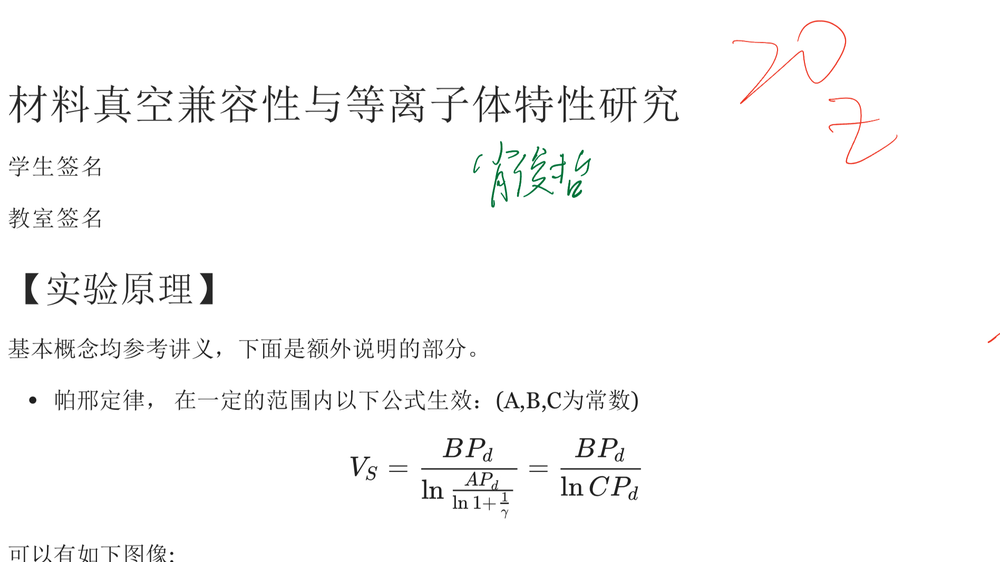
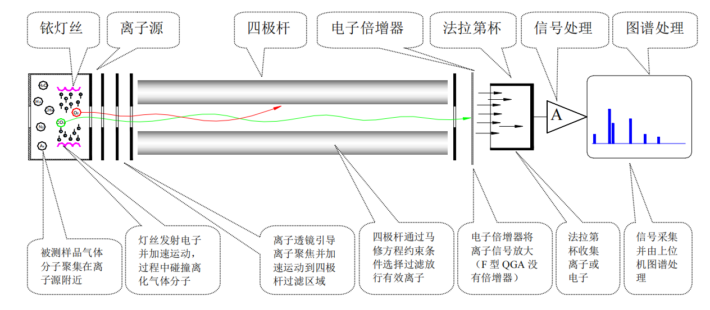
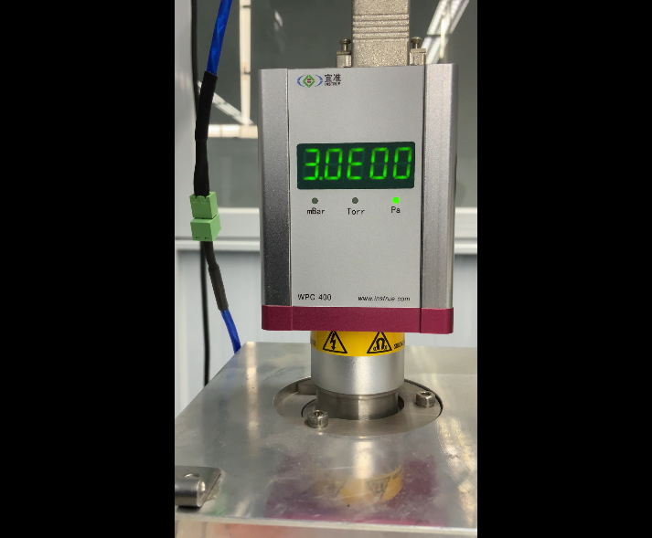
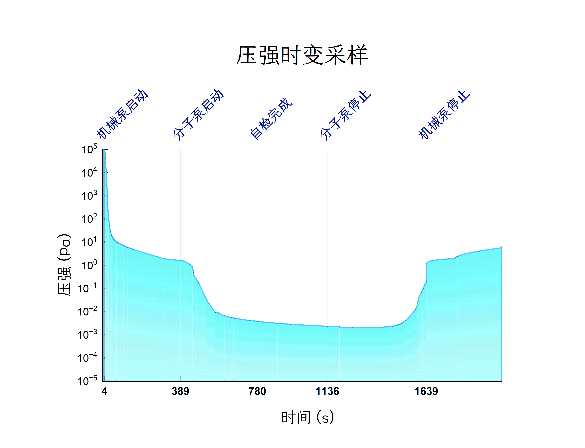
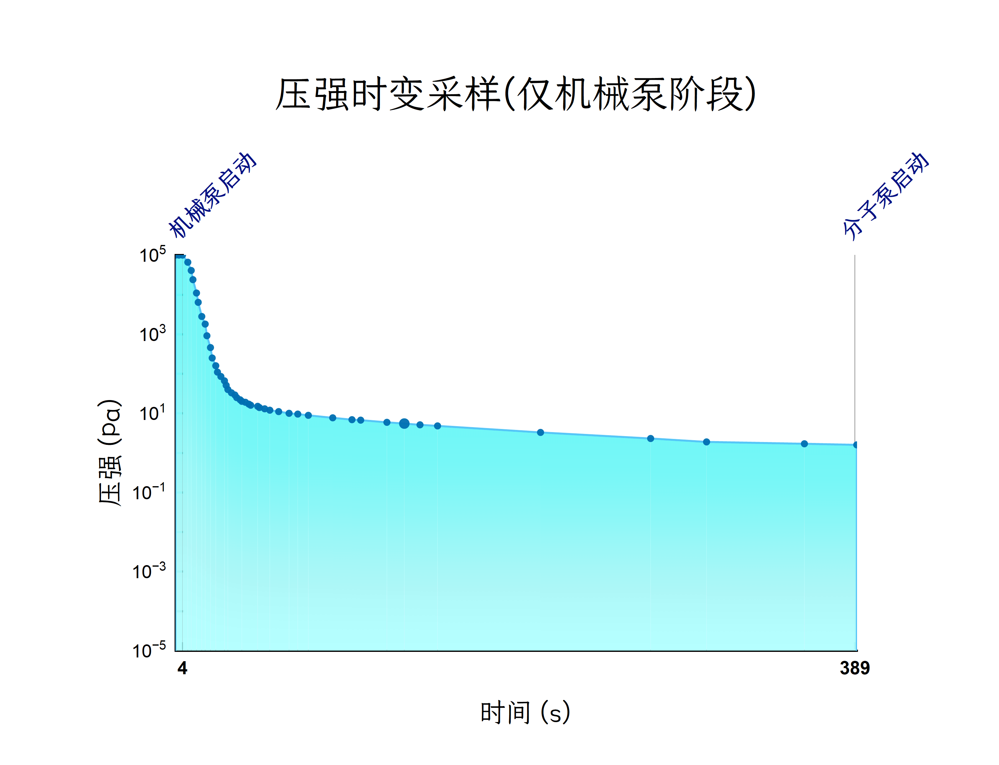
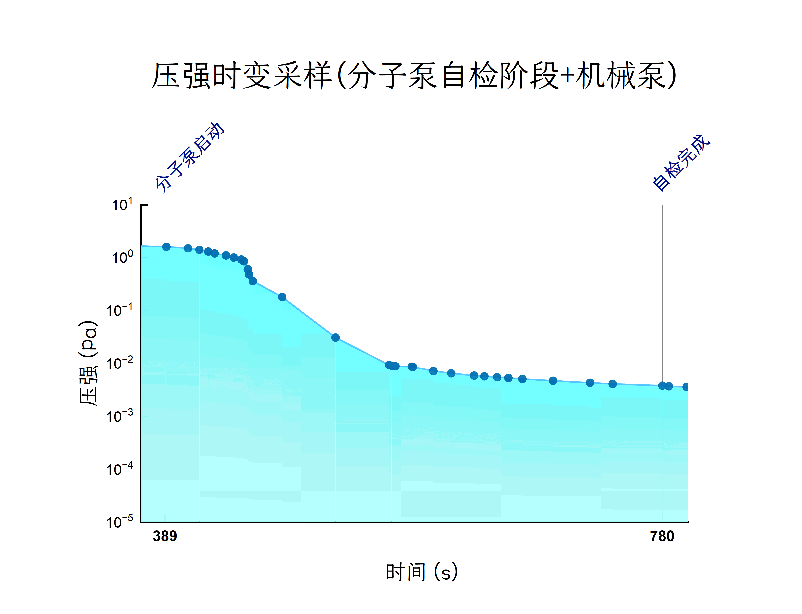
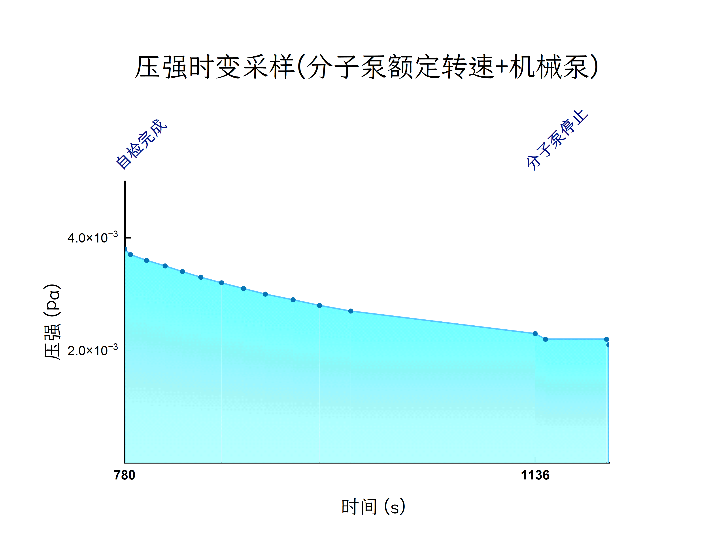
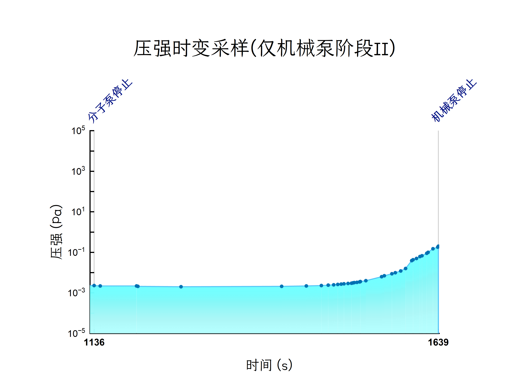
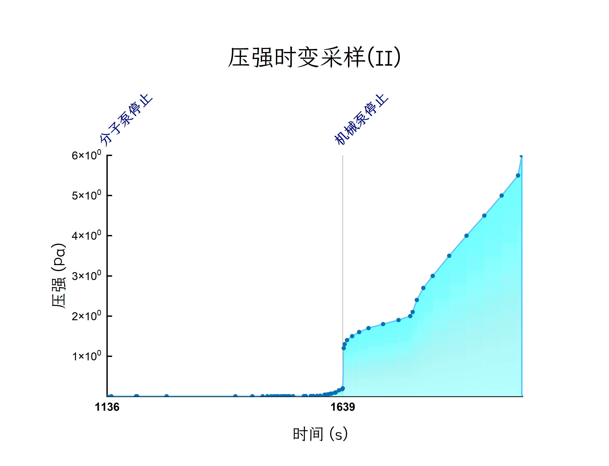
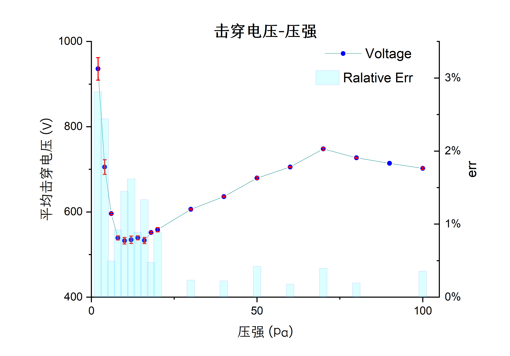

# 材料真空兼容性与等离子体特性研究

## 【实验原理】

基本概念均参考讲义，下面是额外说明的部分。

* 帕邢定律， 在一定的范围内以下公式生效：(A,B,C为常数)

$$
V_S = \frac{B P_d}{\ln{\frac{AP_d}{\ln{1+\frac{1}{\gamma}}}}} 
= \frac{BP_d}{\ln{CP_d}}
$$

可以有如下图像:

可见是有最小击穿电压的。
此时

$$
\ln{CP_0} - P_0/C=0
$$

* 四极杆

其四极场内部电势呈马鞍面分布，沿x,y轴堆成。从而离子在场内的运动遵循马修方程，可以解得稳定区的解: 离子在x, y方向都稳定壳通过

而利用四极杆，进行质谱检测

* 辉光放电
和帕邢定律（均匀电场气体间隙击穿）不同，辉光放电是在低压气体中自持放电现象。实验中我们会使用平行电极板来世家电场，将中性原子或分子激发，在激发态落回基态时放出光。

## 【实验内容】

### 学习使用机械泵和分子泵获得高真空。

1. 动机械泵观察记录真空度随时间 的变化。 
2. 停止分子泵观察记录真空度 随时间的变化。
3. 待分子泵完全停止后，关闭机械泵，记录真空度随时间的变化（5 分钟）。
   
   > **思考：真空度（真空计压强） 随时间变化反映了真空系统的什么特性？**

### **验证帕邢定律**

测量击穿电压与电极间隙和气压之间的关系。 参考讲义步骤，
注意

* 观察放电熄灭电压
* 同一个气压下，三次击穿电压测量值偏差不大于$15\%$可以认为得到了可靠的击穿电压。
* 实验中若用到分子泵请先打开机械泵抽取压强到 10Pa 以下再打开分子泵电源，关闭时请先关闭分子泵红色按钮至转速降为 0 时再断开分子泵总电源开关；

### 观察气体放电（发光） 现象，

利用光纤光谱仪研究气体放电产生的等离子体光谱特性， 获得等离子体基本参数， 了解等离子体物理的基本知识。

**思考： 等离子体光谱反映了等离子体的什么特性？ 能得到等离子体的什么参数？**

### 使用四极质谱仪进行真空系统检漏和气体成分分析。

**探讨： 研究四极电场特性及其中离子运动方程， 深入探讨四极质谱仪工作原理。**

开启机械泵抽真空至10Pa以下才能打开分子泵电源，实验室环境下，我们再气压低于$10^{-3}$Pa时通过气阀注入空气即可。**切记加入后压强不可超过$5\times 10^{-2}$Pa**.

## 【仪器用具】

上海宜准公司VQP01真空平台。（针对帕邢实验、四极质谱实验等实验项目而设计的一台综合实验装置，该装置由真空放电腔体、机械泵、分子泵、高压电源、四极质谱仪、真空计以及击穿电压测量系统等装置构成。）

## 【实验前思考题】

1. 真空物理学的研究内容及方法
   
   > 研究内容：稀薄气体物理运动规律，研究方法：采用统计物理和热力学方法研究稀薄气体分子运动以及气体分子之间、分子与器壁之间的相互作用。

2. 真空的定义？理想气体压强公式？气体分子的平均自由程？
   
   > 给定空间内气体压强低于一个标准大气压的气体状态称为真空。气体密度越低真空程度越好，理想气体压强公式：$p=nkT$，n为气体分子数密度，k为玻尔兹曼常数，T为热力学温度。混合气体的压强遵循道尔顿分压定律。分子自由程：$\bar \lambda = \frac{1}{\sqrt{2}n\sigma} =\frac{1}{\sqrt{2}n\pi d^2}$，$\sigma=\pi d^2$为碰撞截面，d为气体分子直径，n为气体分子数密度，描述一个气体分子与其他两个分子发生碰撞经过的直线路程的统计平均值。

3. 真空气体放电的基本过程？帕邢定律？
   
   > 基本过程：利用外电场加速电子使之碰撞中性原子（分子）来电离气体。帕邢定律：在均匀电场中，气体击穿电压时气体压力p与点击距离d乘积的函数，在一定pd数值，击穿电压有最小值

4. 辉光放电的特点？
   
   > 被激发的中性原子（分子）回到基态，放出光子

5. 等离子体是什么？等离子体的基本参数？
   
   > 等离子体指由离子、电子以及中性原子（分子）的集合组成，整体宏观呈中性的物质状态。基本参数有等离子体温度、等离子体电离度、等离子体温度、德拜长度、等离子体振荡频率、等离子体光谱。

6. 四极质谱仪中四极电场特性如何？其中离子如何运动？四极质谱仪基本原理与过程？
   
   > 两对电极之间施加交变射频场。只允许一定质荷比的离子通过四级分析器到达接收器。
   > 
   > 四极质谱仪基本原理与过程：
   > 
   > 离子源中的电子枪发射出的电子将气体分子电离成离子或离子团，
   > 
   > 电场驱动它们进入四极杆系统，四极杆的电压使一定质荷比的离子通过质量过滤器，不会撞上或逸出四极杆或逸出，从而对进入四极杆区域的离子根据质量电荷比进行过滤，电控单元测量每种质荷比的离子数量，归纳成质谱。

7. 为什么机械泵先抽真空压强低于10Pa以下才能开启分子泵电源？
   
   > 1. 分子泵中，叶片以与分子通过自由程的速度相近的速度讲分子赶入真空区域。而这需要气压足够低， 否则气体分子的自由程过小，分子还未逸出就会发生相互碰撞，抑制机械抽真空，且因为碰撞带来的发热可能损坏分子泵

8. 为什么开启四极质谱仪时保证真空压强低于$5\times 10^{-2}Pa$？
   
   
   > 压强过高分子自由程过短，会使离子偏离正常轨道。分子碰撞可能会发生一些不可预测的反应。气体可能会放电损坏灯丝。

9. 列举三个真空科学与技术应用的实例。
   
   > 真空冶金、真空离子镀膜、沉积加工

10. 列举三个等离子体科学与技术应用的实例
    
    > 烟气脱硫、制备催化剂、高聚物表面处理。
    

## 【分析与讨论】

### 一、获得高真空

我们在实验中拍摄了气压计的时变影片。如图

约6分钟后，当气压下降至1.7Pa时，我们启动分子泵后，泵进行约一分钟的自检，转速降低到64转，后会重新上升到450转。

全过程压强时变图像如下图（图中压强指代真空计压强，即真空度）

下面是各阶段的：

* 仅机械泵抽真空阶段:

* 分子泵启动自检阶段：

* 分子泵维持448转速持续工作阶段:

* 停止分子泵，机械泵工作的情况

* 停止机械泵情况

### 二、测量击穿电压与电极间隙和气压之间的关系

可以发现，每一处压强测量的三次电压，偏差都不超过$15\%$.所以可以采用为可靠的击穿电压。
离散值数据集中，

### 三、气体放电现象与等离子体光谱特性研究

### 四、四极质谱仪工作原理
