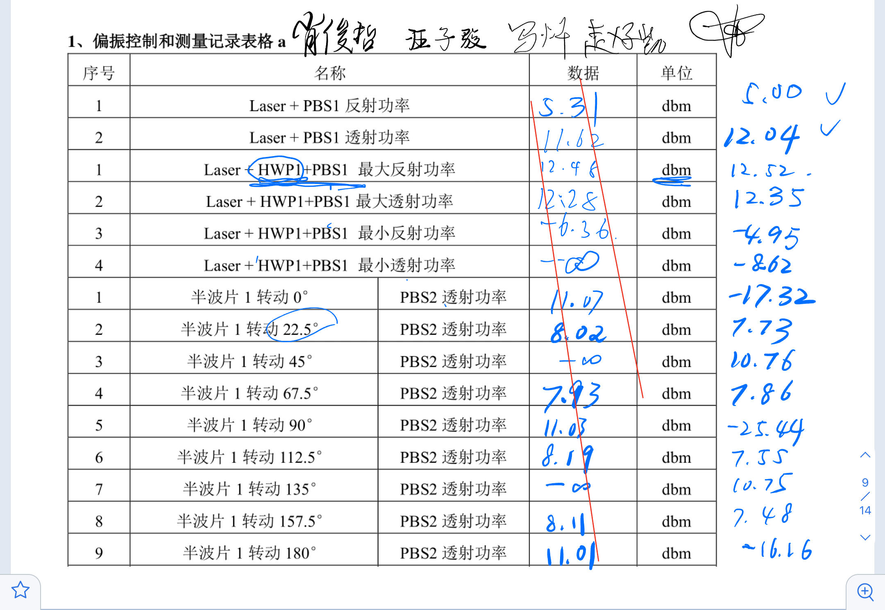
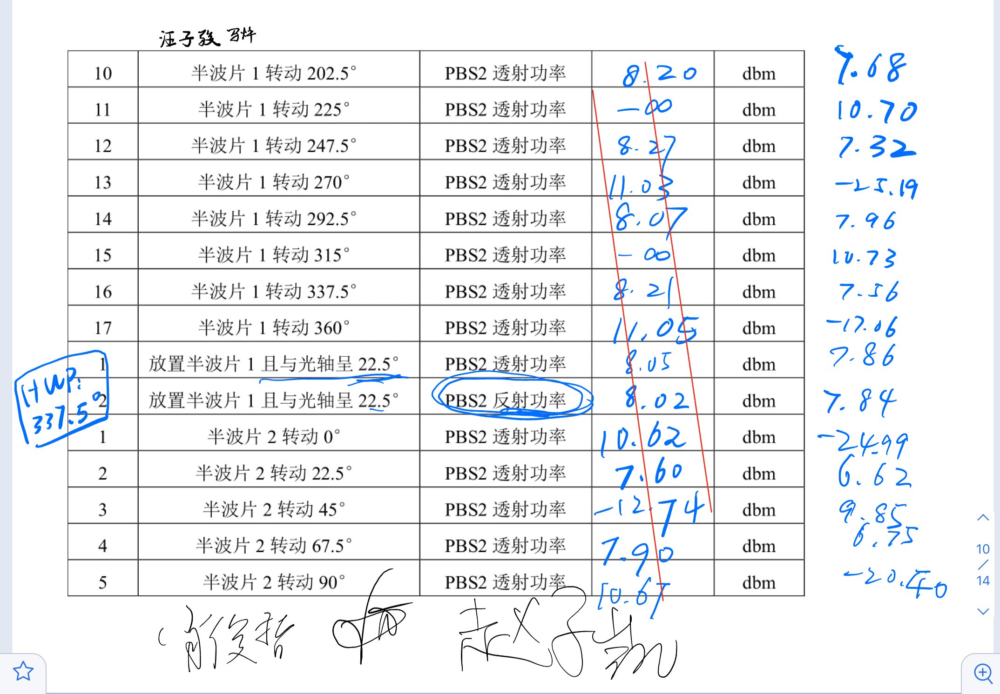
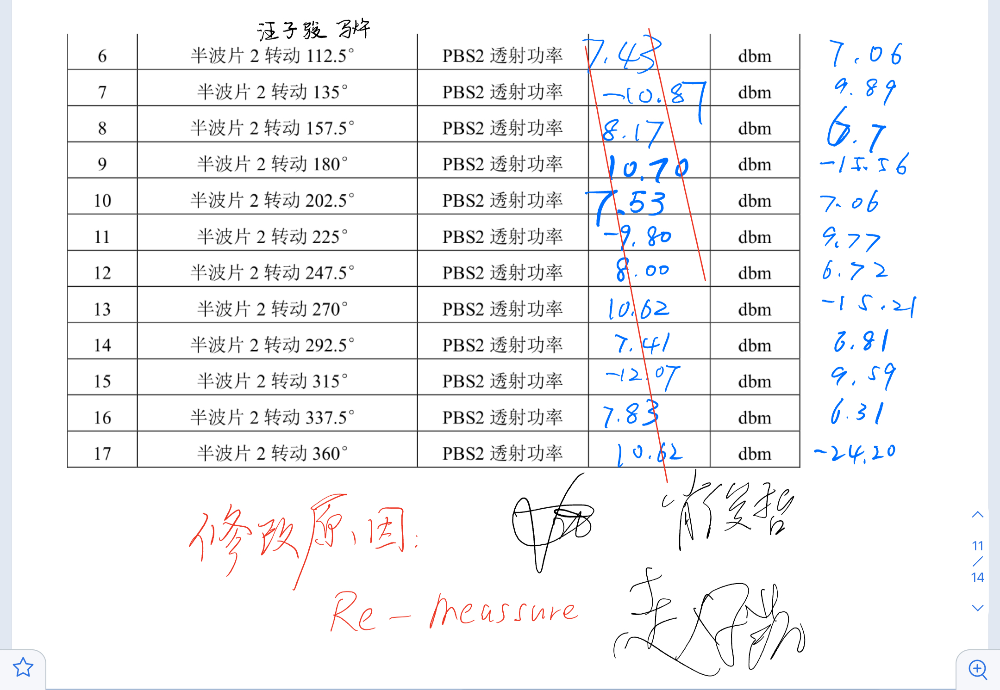
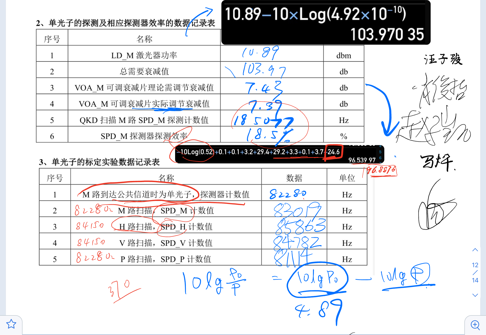
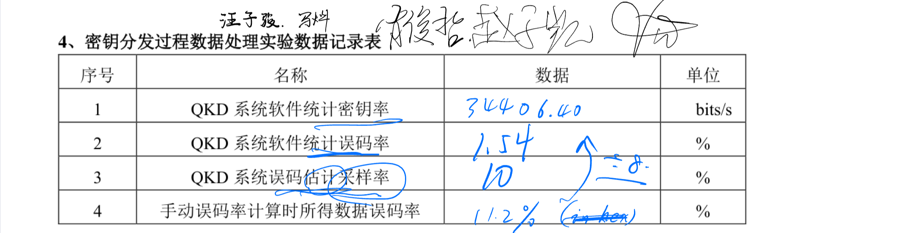
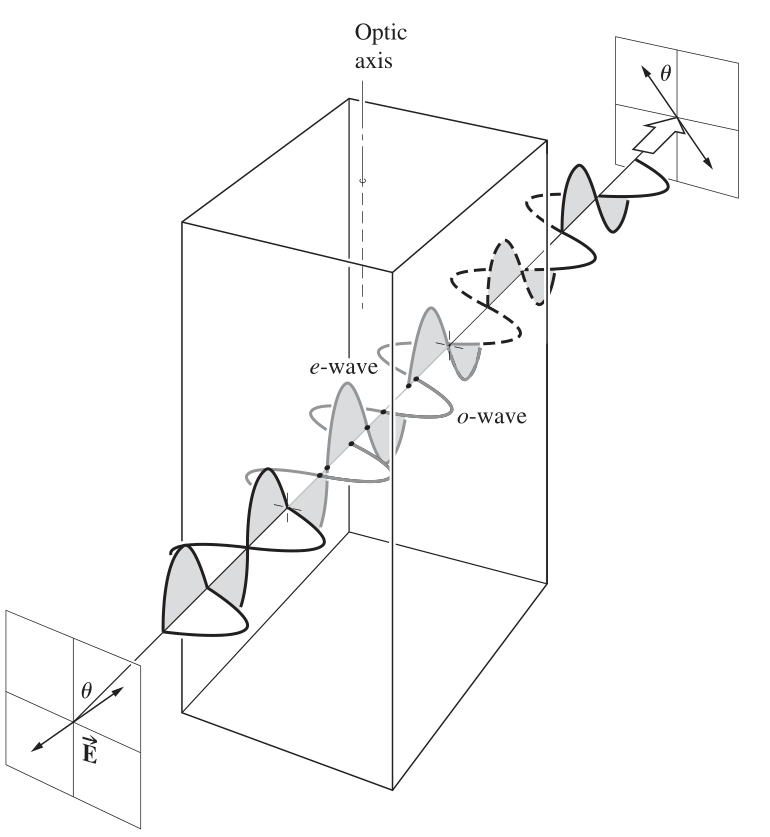
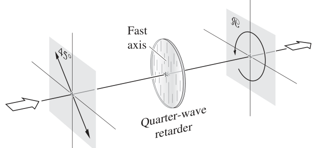
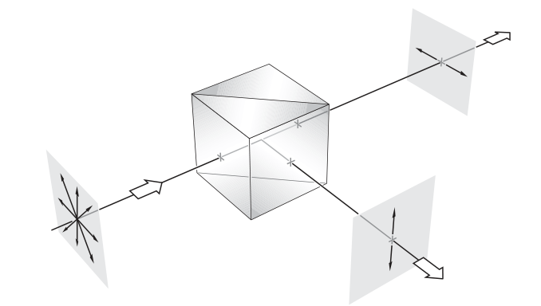
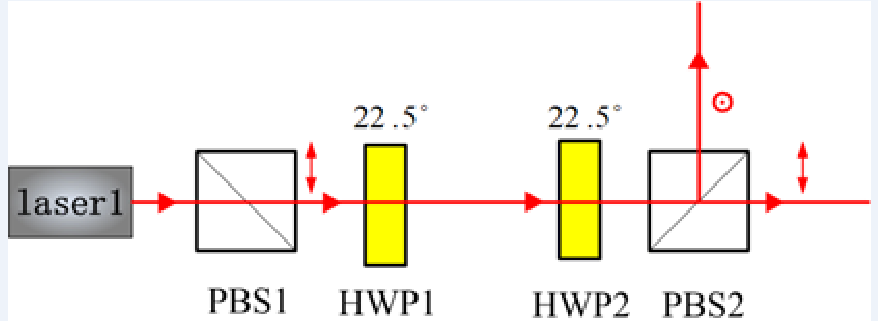
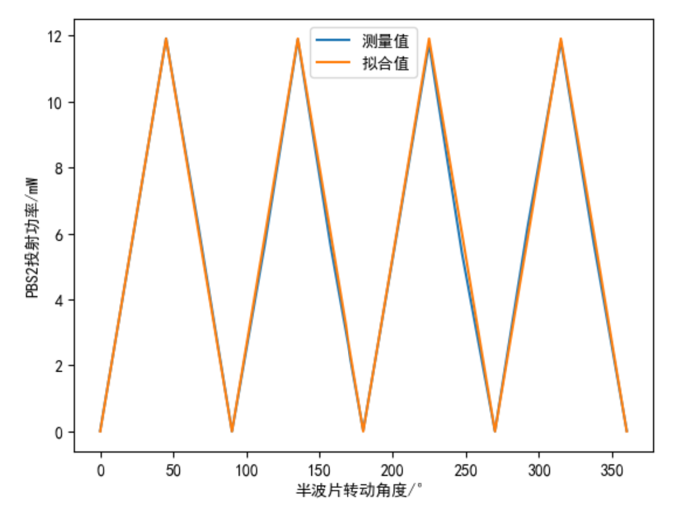

# 数据记录和签名 
下面是数据和签名：

# 预习报告

## 【实验目的】

1.    掌握控制和测量光子的偏振；
2.    掌握**单光子**的标定；
3.    掌握单光子的探测及相应探测器效率的测量；
4.    掌握BB84量子密钥分发过程的数据处理。

## 【预习思考题】
1. 半波片、四分之一波片的工作原理:
> ANS:  沿着光轴方向，前后表面平行，两束平面波会穿过晶体但是由于$v_{\parallel} > v_{\bot} , n_o > n_e$. 快轴上的光会更快穿过波片。于是又相差$\Delta \varphi = k_0\Delta L= \frac{2\pi}{\lambda}d(\Delta n)$.半波片构造的相差为$\pi$.四分之一波片构造的为$\frac{\pi}{2}$.结果上看半波片可以让图中$E_Y$落后$180\degree$再合成, 四分之一波片同理。
> 
>  
2. 如何检测一个任意方向的线偏振光 
> 如果我们实用Stocks参数来描述偏振:
 $$
S=\left[ \begin{array}{l}
	S_0\\
	S_1\\
	S_2\\
	S_3\\
\end{array} \right] 
$$
> 一个常规的光束入射过一个线偏振片，分别测量透射轴为:H,V,+$45\degree$R的功率，然后插入快轴沿水平方向的1/4波片继续测量功率, 如此得到$S_{1,2,3,4}$。
> 当然还可以多次旋转四分之一波片来测量。

3. 单光子为什么不能直接用普通功率计测量
> 单光子发射源**只能在自发辐射寿命期间（约ps到ns时间尺度）发射出一个光子**，没有倍增的情况下，常规的光电二极管探头也很难充分生成光电流，其他热敏探头也同理。灵敏度不够。当然还有其他原因，但再探头环节普通的功率计就已经无法测量了。
5. 检验单光子探测器的探测效率可以用强光吗？
> 不能。强光由于无数光子同时到达，脉冲难以分辨这样无法计数，
7. BB84协议原理和步骤
> 1. Alice制备单光子,选定基产生随机序列
> 2. Alice发送光
> 3. Bob接受光，根据自己的随机基进行测量
> 4. 双方在经典公开信道对基，
> 5. 检验误码率
> 6. 若传输有效，则保留生成的密钥序列
8. QKD中为什么要有同步信号？
> 要尽量保证单光子技术的准确。信号同步性越好，单光子技术越准确。
## 【实验原理】

### 偏振的测量和控制
* 偏振分光棱(PBS): 当一束光垂直入射面入射，水平分量的光将会透射，垂直分量的光将会反射；即透射端口为水平偏振光，反射端口为垂直透射光。出射的两路光一定是线偏振。

* 分光棱镜(BS)：分光比对入射偏振敏感，若入射的是自然光或圆偏振光，则1:1分光。BS只分能量，理想BS的两路分光保留入射光的偏振态，不吸收光强。
* 消偏振分光棱镜(NPBS):分光比在任何情况都是1:1.其他分光效果类似BS。

检测偏振态：
1. 用PBS透射端获得一个水平偏振光
2. 利用半波片HWP1旋转$\theta$, 得到一个偏振$2\theta$的线偏光($\theta = 22.5\degree$则两光束功率1:1)
3. 再在HPW1后引入同样的半波片
4. 在PBS2的反射段得到零功率，即完成了完美线偏光的制备。

### 单光子探测
1. 使用微弱光信号来激发出光电倍增管的大量电子
2. 电子倍增进入阳极
3. 阳极输出电流脉冲
4. 电流脉冲转换为电压脉冲并放大
激光器的发光重复频率$f$, 单个$\lambda$光子的能量$E=h\nu=\frac{hc}{\lambda}$，平均光子数脉冲$\mu$。则功率时
$$
P=\mu f  E
$$
相比于激光器的发光功率，激光口发光的衰减为
$$
g = 10\log{\frac{P_0}{P}} = 10\log{\frac{P_0}{\mu f E}}, (dB)
$$
$N$为单光子探测器的扫描计数。
得到单光子的探测效率
$$
\eta = \frac{N}{f\mu}
$$

![[system_visio_graph.png]]

### 单光子标定

用经过强衰减的脉冲激光代替单光子光源[[1]](#_ftn1)。
实验用的404nm脉冲激光器的发光重复频率为10MHz

为了实验的简单，在本实验中采用单光子探测器来标定衰减器的衰减值。例如，标定单光子为0.05光子/脉冲时，探测器效率为20%时，则到达单光子探测器的计数应该(N)=激光器发光频率 平均光子数脉冲 单光子探测器探测效率 
$$
\eta =10 \cdot 10^6 \cdot 0.05\cdot20\%=10^5 
$$

---

[[1]](#_ftnref1) 严格讲，当激光二极管产生光脉冲的强度被大幅度衰减值极弱时，其光子数分布服从泊松分布。即每个光脉冲中包含n个光子的概率为 ，其中 表示光脉冲的平均强度。因此，强衰减激光仅是一种近似单光子源，当 量级时，这是一种较好的近似。

### BB84 协议
为了让公钥系统的密钥传递更加安全，可使用QDK，这里讨论基于BB84协议的QKD
主要的步骤是量子通信和传统的密钥通信方式，在双方都随机选择基并且Bob收到并且用自己的基翻译了Alice发出的二进制串，双方进行比对，保留正确基位对应的二进制数作为密钥。由于量子通信信道上无法窃听， 一旦发生窃听，通讯就取消。
Alice和Bob两端传输探测完成后会得到一系列两位编码的信息数据，首先需要对两端的数据进行对基，再对对基的数据进行比对，计算出系统的误码率。当误码率低于理论安全界限11%时，本次传输有效，继续进行后续处理过程。

## 【实验内容】

### 一： 偏振光检测控制与制备
1.     以激光器出射光高度为基准，安装光学元件，使光束从轴心位置通过；
2.     在激光器后放置PBS1，PBS1要与激光光束相垂直，之后测量激光通过PBS1后的反射和透射功率，记下数值（附录1）。假设激光器发出的光是线偏振光，求激光器发出的线偏振光与水平方向的夹角是多少？
3.     在激光器和PBS1之间放置半波片1（HWP1），转动半波片1的角度找到透过PBS1的光功率的最大值和最小值并记录下来，并通过测量推倒该激光器是否完美的线偏振光？
4.     在激光器后依次放置PBS1，HWP1和PBS2。转动半波片1的角度360度，记下转动不同角度时，PBS2出射端的功率变化，确定出光功率最大或最小时刻的镜架的刻度，此时的刻度即HWP1为的0°光轴（半波片光轴对应角度）。此步骤一定要注意半波片的光轴和镜架的0刻度不一定重合，所以需要通过实验测试确定半波片的光轴。
5.     使用上述图1-2的实验装置，将HWP1的角度调至光轴位置来制备偏振态D（或与态D垂直的态）。转动HWP2，记录透过PBS2的光功率随着HWP2角度的变化。HWP2应该位于什么位置才可以确定地测量PBS2之前的光确实在D态(或垂直于D态)

### 二: 单光子探测和探测效率

1.      单光子的标定如图3-1所示，H、V、P、M路光路到达公共信道时，出射光为单光子状态；
2.      理论计算当公共信道平均光子数为0.2光子/脉冲时，经过接收端光路衰减到达单光子探测器的探测计数N；（以M路光路为例计算）
3.      发送端和接收端电路控制模块上电，启动QKD软件；
4.      选中QKD软件Alice-Bob链路，点击软件上方的工具栏，选择扫描模式；
5.      选择M路扫描，调节VOA_M可调衰减片，使得SPD_M扫描计数接近N；
6.      依次分别选择H、V、P路扫描，也使得对应的探测器扫描计数接近N；上述过程即完成密钥分发系统的单光子标定。

### 三: 单光子标定

1.      单光子的标定如图3-1所示，H、V、P、M路光路到达公共信道时，出射光为单光子状态；
2.      理论计算当公共信道平均光子数为0.2光子/脉冲时，经过接收端光路衰减到达单光子探测器的探测计数N；（以M路光路为例计算）
3.      发送端和接收端电路控制模块上电，启动QKD软件；
4.      选中QKD软件Alice-Bob链路，点击软件上方的工具栏，选择扫描模式；
5.      选择M路扫描，调节VOA_M可调衰减片，使得SPD_M扫描计数接近N；
6.      依次分别选择H、V、P路扫描，也使得对应的探测器扫描计数接近N；上述过程即完成密钥分发系统的单光子标定。

### 四:密钥分发数据处理

1. 发送端和接收端电路控制模块上电，启动QKD软件；
2. 点击QKD的接收端控制界面（Bob-Alice），选择误码平均采样率后点保存；点击QKD的发送端控制界面（Alice-Bob），勾选中间密钥输出功能，点击保存；选中工具栏中的蓝色R（密钥随机分发），点击右侧的运行按钮；待系统运行5-10秒后，点击停止按钮。此时，记录下系统的平均误码率；
3. 在桌面的自由空间偏振文件夹中查看中间密钥输出的数据，输出的数据主要包括原始数据（raw），对基后数据（sift），纠错后数据（reconcile），最终安全密钥数据（key），对应的发送端分别为：transmitter-raw、transmitter-sift、transmitter-reconcile、transmitter-key，接收端分别为：receiver-raw、receiver -sift、receiver -reconcile、receiver -key;
4. 打开桌面上的软件Beyond Compare，选择文本比较，进入界面，点击最上方的会话选项（如图4-4），比较文件用，选择十六进制文件。分别打开transmitter-sift和receiver -sift，然后通过会话中16进制比较信息进行误码估计，由于QKD软件保存的数据格式均为十六进制，所以实际误码估计时需要将十六进制转为二进制文件进行比对。（例如总共100个二进制数据，两端有5个错误位，则误码率为5%）

---

# 数据记录

---

# 分析讨论
### 实验一：

实验中测量到激光通过PBS1后反射功率$P_r=5.00dbm=3.16mW$，透射功率$P_t=11.62dbm=14.52mW$，若认为激光器发出线偏光，则水平分量为14.521mW，竖直分量为3.16mW，与水平方向夹角为$\theta = tan^{-1}(\sqrt{\frac{P_r} {P_t}})=25.022\degree$最大反射功率为12.52dbm，最大投射功率为12.35dbm，可以认为最大反射功率与最大投射功率相同，因此不会存在圆偏振光，激光器发出的是线偏振光
转动半波片1，每旋转半波片1θ角，偏振光的偏振方向转动2θ，透射光功率与根据马吕斯定律拟合出的理想数据如图所示。

以透射光功率最大值为初始光强，根据马吕斯定律拟合，可以看到实验数据与马吕斯定律拟合函数$P=11.91cos^2(2x-90)$相符合，符合马吕斯定律。由透射光功率最大值的HMP1角度可以得到光轴角度约为$45\degree$。
HWP1与主光轴夹角为$22.5\degree$时，反射功率与透射功率为7.86dbm和7.84dbm。此时偏振光处于偏振态D或者与D垂直。
同样对旋转HWP2的数据进行拟合。

透射光强度较于一个半波片下降了越2，25mW。两次的透射光功率最大点相同，证明两个半波片的主光轴角度一致。当HWP2主光轴与HWP1垂直式，入射PBS2的光处于D态，而此时的呕吐设光功率也是最小的
### 实验二

我们已经计算出$f_\mu=10^6$.
LD_M激光器的光功率为10.89dbm。要使探测器探测到0.1个单光子每脉冲，整个光路的总衰减值为$x=103.97dB$，光路上的元件一共提供衰减$96.54dB$，
需可调衰减器衰减$7.43dB$，则通过可调衰减器后的入射光功率为$3.46dBm$，探测计数值为185077，则SPD_M探测效率为$\eta = \frac{N}{f_\mu}=18.5\%$
### 实验三

### 实验四

Beyound Compare以字节为单位比较误码率，该十六进制文件只要8bits中有错误即会被视为错误，所以若字节误码率与二进制误码率相同，则需要每个字节只能有一个误码。总共$64N$ bits, 有$8N$ bit的误码，且误码之间间隔均匀为8，此时字节误码率就为二进制误码率的八倍。
实际情况显然不可能如此，那么总会有许多bits的误码都只被算进一个字节，即$64N $bits, $8N $bit的误码下，在字节视角下为 $8N$ bytes, $yN$ bytes误码， $y < 1$. 这样误码率 $  \eta_{bytes} = \frac{yN}{8N} < \frac{1}{8} =  \eta_{bits} = \frac{8N}{64N}$. 
实际数据我们也可以得到这个结果:$1.54% \times 8 = 12.32\% > 11.2\% $
略大于手动计算的误码率。可以认为通信有效。

## 【实验后思考题】

1.  是否可以通过直接衰减任意的光源（比如白炽灯）的强度到单光子级别来得到真正的单光子源？（真正的单光子源是指每次触发可以确定性的得到一个仅包含一个光子的光脉冲信号）。
> 不可以
> 1. 经典强光通过线性光学衰减本身就和导出非经典的“单光子”本身没有必然的逻辑关系。
> 2.白炽灯这类光源是热辐射自然光,经过衰减后仍然是相干的，在统计上不会得到单光子的统计分布。
2. 了解单光子探测器暗计数的原理，并设计实验装置测量探测器的暗计数率。
> 将包含单光子的脉冲引导到探测器中，利用载流子的电效应激起来隧穿电流。
3.  量子密钥分发实验中对基后的数据，为什么会有误码出现，如何降低误码？
> 由于Alice和Bob的首发光子在前，对基在 后，所以对基后，双方已经能够保证同基，对基后双方再将捕获到的偏振态信息转换成密钥比特，这是过程A，可能出现误码。A过程后，双方通过经典继续对密钥进行处理，这个过程B也可能造成误码。 A、B过程都可能造成误码的出现，主要是因为实际的光子传输探测并非理想的。在过程中偏振态会受到干扰。

