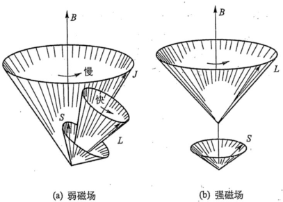
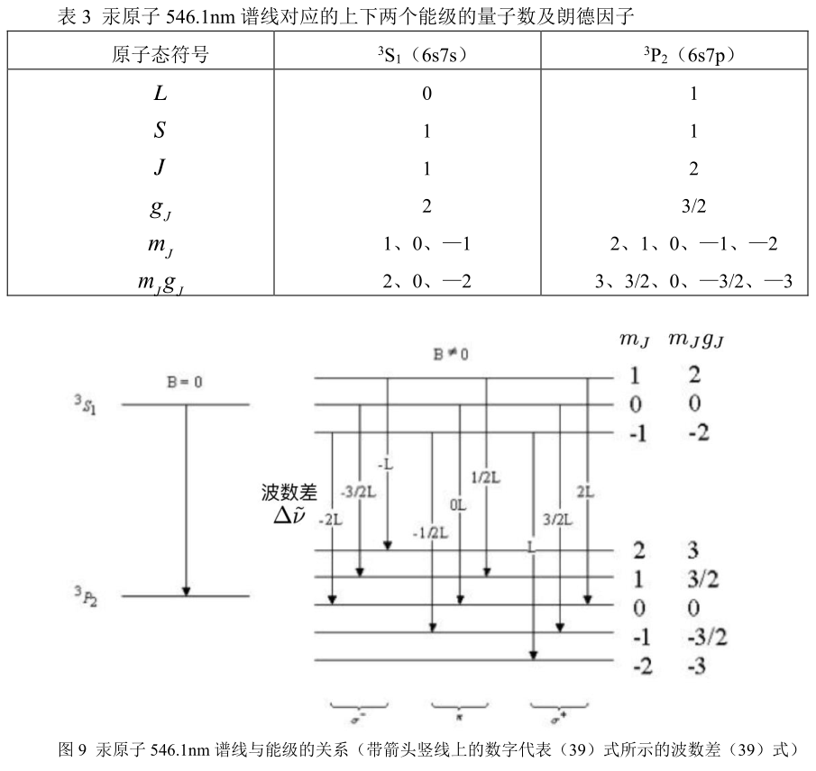
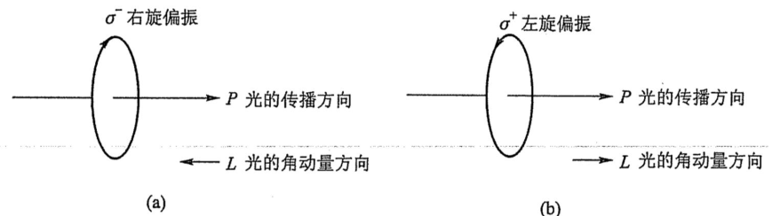
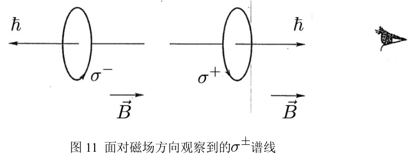
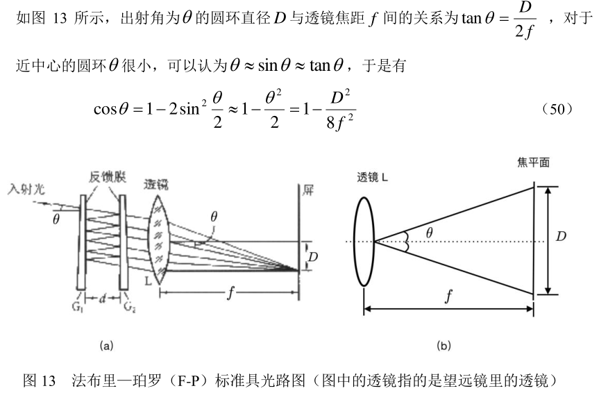

# 塞曼效应

[toc]

## 
【仪器】 

* F-P标准具
* Capstone 软件
* 塞曼效应实验装置
* 546.1nm汞灯
*

## 
【原理】 

### 电子磁矩

$\gamma \equiv \frac{e}{2m_e}$为回旋磁比率。我们可以取轨道角动量的本征值$L=\sqrt{l(l+1)}\hbar$

$$
\mu_l = \frac{e}{\frac{2\pi r}{v}} \cdot \pi r^2 \vec{e_n} = -\gamma \vec{L}\\
$$

轨道角动量的$z$分量$L_z=m)l\hbar$.自旋角动量的$z$分量$S_z=m_s\hbar, m_s=\pm \frac{1}{2}$

### 角动量耦合

令两个电子的轨道角量子数和自选角量子数分别为($l_1$, $s_1$), ($l_2$, $s_2$),则它们有$C_4^2=6$种可能的相互作用。其中($l_1$, $s_2$)和($l_2$, $s_1$)的强度比较弱可忽略。对于其余四种，可以分为*LS耦合*和*JJ耦合*。

本实验考虑更常见的*LS耦合*。其最终的总轨道角量子数和自旋量子数，以及总角量子数分别为:

$$
L=l_1+l_2,...,\lvert l_1 - l2 \rvert\\
S=s_1+s_2,...,\lvert s_1 - s_2 \rvert\\
J=L+S,...,\lvert L-S \rvert\\
m_J=0,\pm 1, \pm 2,...\pm J\\
$$

本实验汞为放电管光源，研究汞原子在546.1nm普贤在外磁场种的分裂。是汞原子的外层两个电子从$^3S_1(6s7s)$到$^3P_2(6s7p)$的跃迁而产生的。
| |  $^3S_1(6s7s)$| $^3P_2(6s7p)$ |
| --- | --- | --- |
|L |0 |1 |
|S |1 |1 |
|J |1 |2 |

### 电子总磁矩和势能

由前面所得。尝试计算汞原子总磁矩$\vec{}\mu$和在外磁场$\vec{B}中的势能$U$。

我们是在一个弱外场中进行实验，$B_{ext}\ll E_{inn}$, 核外电子自旋磁矩与核内磁场相互作用依然更显著，所以这里我们仍然假设总角动量*LS耦合*。此时$\vec{J}$会绕外磁场慢速进洞。$\vec{S},vec{J}$会快速绕着$\vec{J}$进动。电子总角动量守恒，L,S分量均不守恒。
  

通过

$$
U = =-\vec{\mu}\cdot\vec{B}
$$

已知电子或原子系统的总磁矩，就可求得原子在外磁场中的势能。一般考虑电子总磁矩即可，是因为原子核磁矩在不考虑超精细结构时可以忽略。

我们先会要求磁矩，发现朗德因子需被表达：
$$
\vec{\mu}=-g_J\gamma\vec{J}\\
\mu_J = \sqrt{J(J+1)}g_J\mu_B\\
\mu_{J[z]}=m_Jg_J\mu_B, m_J=0,\pm 1,..., \pm J\\
\implies\\
g_J=\frac{3}{2} - \frac{L(L+1)-S(S+1)}{2J(J+1)}
$$

下面继续考虑磁矩受力矩的拉莫尔进动。由拉莫尔进动我们可以得到若干物理量

$$
\frac{\mathrm{d}\vec{v}}{\mathrm{d}t} = \vec{\omega}\times \vec{\mu} = \gamma \vec{B} \times \vec{\mu}
$$

电子总磁矩在外磁场中：
$$
U=-\vec{\mu_J}\cdot \vec{B} = m_Jg_J\mu_BB
$$

### 汞原子能级分裂

原子在有$B_{ext}$时，能量发生附加的势能产生能级分裂。

$$
h\nu = E_2-E_1\\
h\nu'= (E_2+\Delta E_2) - (E_1 + \Delta E_1) \\
= h\nu + (M_2g_2 - M_1g_1)\mu_B B\\
$$

有频率差和波数差

$$
\Delta \nu = (M_2g_2 - M_1g_1)\mu_B, \mu_B = \frac{eB}{4\pi m}\\
\Delta v=\Delta (\frac{\nu}{c}) = (M_2g_2 - M_1g_1)L\\
$$

  

由于跃迁的选择性:
$$
\Delta L=0,\pm 1,\\
\Delta S = 0,\\
\Delta J = 0, \pm 1\\
$$

### 塞曼效应

对于一个沿$\hat{z}$传播的电磁波，分解其电场矢量:

$$
E_x = A\cos{\omega t},E_y=B\cos{\omega t - \alpha}
$$

当$\alpha=0$.线偏光。$\alpha=\frac{\pi}{2}$且$A=B$时， 为圆偏振，其具有角动量，方向与电矢量旋转方向组成右手螺旋定则。

  

对于$\Delta m = \pm 1$.考虑角动量守恒，可以得到光的角动量和光传播方向一致与相反的情况：
  

对于$\Delta m = 0$， 原子在磁场方向的角动量不变，光子具有固有角动量$\hbar$。实际上范式角动量方向在xy平面上任意光子都满足能级跃迁前后$\Delta m = 0$的条件。所以平均效果时$E_y=0$。于是在垂直$\hat{x}$的方向观察，只能看到$E_z$分量，观察到线偏振光$pi$.

  

### 法布里-玻罗标准具

谱线分裂的波长差很小。
$$
v = \frac{1}{\lambda}(系数2\pi可以不用)\\
\mathrm{d}v = -\frac{1}{\lambda^2}\mathrm{d}\lambda \\
\mathrm{d} \rightarrow \Delta, \\
$$
可以得到$\Delta \lambda$极小。需要使用F-P标准具等仪器来测量：
> 由于两镀膜面平行，若使用扩展光源，则产生等倾干涉条纹。具有相同入射角的光线在
> 垂直于观察方向的平面上的轨迹是一组同心圆。若在光路上放置透镜，则在透镜焦平面上得
> 到一组同心圆环图样。 在透射光束中，相邻光束的光程差为

$$
\Delta = 2nd\cos{\phi}\\
2nd\cos{\phi} = K\lambda\\
$$

F-P具的分辨本领
$$
\eta = \frac{\lambda}{\Delta \lambda} = KN
$$
K为干涉级次, N为精细度.
$$
N=\frac{\pi \sqrt{R}}{1-R}
$$

由F-P标准具，测量近似波长差:
  

### 计算荷质比$f=\frac{e}{m}$

$$
f=\frac{4\pi c}{ndB}(\frac{D_a^2 - D_k^2}{D_{k-1}^2} - D_k^2)
$$

## 
【实验步骤】 

1. 准备工作
   1. 正确连线
   2. 确保汞灯正常，电流为0
   3. 打开Capstone，观察实时采集图像，调整至分辨率最高
2. 光路调整
   1. 调整相机模块，使汞灯位于屏幕中心，图像清晰
   2. 调整聚光透镜和偏振片
   3. 调整F-P和干涉滤光片
   4. 获得清晰干涉图像
3. 观察谱线分裂
4. 计算荷质比$\frac{e}{m}$
5. 平行于磁场方向观察
6. 调整光路
7. 观察到圆偏振

## 
【实验记录】 

## 
【实验思考题】 

1. 光子是否具有角动量？试描述光子角动量方向与光的偏振方向之间的关系。
   >  ANS
2. 用同一级条纹的内外圈分别计算电子的荷质比，结果一样吗？试简述原因。
   >  ANS
3. 请利用（20）至（23）式，计算汞原子3S1（6s7s）和3P2（6s7p）能级所对应的量子数（见表 1），并给出详细的计算过程。
   >  ANS
4. 请利用（2）、（8）和（20）式，并结合和（注意此时的是图 5 中的，详细见脚注 22），导出朗德因子的一般表达式（28）式，并给出详细的
推导过程。
   >  ANS
5. 请利用单电子情况下的（36）式，并结合钠双黄线的平均波长及其波长差（λ1 = 589.0 nm，λ2 = 589.6 nm），估算一下钠原子内部的磁感应强度 Bint的值（提示：单电子情况下，两谱线的能级差为势能的两倍，即有；另需要利用到光子波长和频率之间的关系式。答案：钠原子内部的磁感应强度 Bint的值为 18.5T）。
   >  ANS
6. 请结合第 5 题的计算结果，说明弱外磁场 $B_{ext}<<B_{int}$成立时弱外磁场 $B_{ext}$的取值范围，并确认本实验中电磁体的磁感应强度符合弱外磁场 $B_{ext}<<B_{int}$条件。
   >  ANS
7. 请结合力与势能的关系式并利用（11）式，试推导磁矩在非均匀外磁场中的受力大小为（设外磁场方向在 z 轴方向，Fz为力在 z 方向上分量的
大小）（提示：请利用郭硕鸿《电动力学》（第二版）一书附录中的矢量运算公式）。
   >  ANS
8. 请结合朗德因子的一般表达式（28）式，以及两个角动量耦合的一般规则（20）至（23）式，计算表 3 中汞原子 546.1nm 谱线对应的上下两个能级的各量子数及不同谱线（能级跃迁）的朗德因子（见图 9）。用“格罗春图”33（Grotrain 图）来表示汞原子 546.1nm谱线不同能级之间可能的跃迁。
   >  ANS
9. 请回答什么是“反常塞曼效应”和“正常塞曼效应”，两者之间的区别是什么。请思考什么是“帕邢－巴克效应”及其形成的原因。
   >  ANS
10. 请回答电子的“自旋—轨道耦合”的本质是什么？它与电子之间的“LS 耦合”的区别是什么？
    > ANS
11. 请结合多电子原子及电子组态的相关知识，思考为什么像汞原子一样有两个价电子的元素（氦 He 和镁 Mg 等第二族（碱土族）元素），会有两套不同的谱线（一套是单线结构，一套是双线结构）。
    > ANS
12. 设 F-P 标准具两反射面之间的距离为 d=2 mm，请根据（47）式估计汞原子 546.1nm 谱线的自由光谱范围。
    > ANS
13. 请根据（38）式，估计在外磁场为 B=1T 时观察汞原子 546.1nm 谱线分离所要求的仪器分辨率的$\eta$，并讨论用 F-P 标准具观测的必要性（一般棱镜摄谱仪的理论分辨率为$10^3~10^4$，F-P 标准具的理论分辨率为 $10^5~10^7$，实际分辨率比理论值要略低一些）。
    > ANS
14. 仔细观察垂直磁场方向观察，旋转偏振片至 450角的纪录，会发现同一级条纹在磁场中分离成不只三条，请解释出现这一现象的原因。  
    > ANS
15. 本实验要求精度为实验测量误差小于等于 5%，请分析本实验误差的主要来源，并提出相应的修正方法。
    > ANS
16. 请尝试计算钠双黄线（又称“钠 D 线”，是由钠原子从2P1/2, 3/2 到2S1/2态的跃迁所产生）谱线的塞曼分裂（如图 21），可能的话，设计具体实验步骤并进行观察验证。
    > ANS
